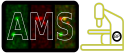
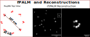

# AMS-BP
<p>

</p>

## Advanced Fluorescence Microscopy Simulation Tool

AMS-BP is a powerful simulation tool for advanced fluorescence microscopy experiments. This guide covers both command-line usage and library integration.

## Overview of Simulation Workflow


*A ground truth is created, **a**, with $`f_{n}`$ fluorophore types of $`N_{f_{n}}`$ molecules each. If applicable, the motion of these molecules is modelled using a 3D bounded FBM with fluctuating generalized diffusion coefficients and Hurst parameters. Variations are modelled as a Markov Chain and require rate constants as parameters. Different fluorophores can have different motion models. The resolution of the motion models is $`\Delta t`$ and cannot be smaller than 1 ms (for computational efficiency). Given the microscope parameters specific to the experimental procedure to simulate, at every time $`t_{j}`$, the excitation intensity for each channel (**b**) is calculated at each fluorophore's location, **c**. For $`t_{j} \rightarrow t_{j+\Delta t}`$, the photophysical state trajectory of the fluorophore is simulated using the light intensity at the molecule's location as input for any light-dependent transition rates, **d**. For the duration that the shutter is open and light is emitted from the sample, emission filters for each channel are applied before the convolution with PSF models, **e**. The incident photons on the detector are then converted to photoelectrons and finally to digital units using the detector models provided, **f**.*

## API Reference and Docs
Find detailed API references for the library at: [joemans3/github.io/AMS_BP](https://joemans3.github.io/AMS_BP/)
> A more detailed example is provided in the jupyter notebook in the examples. For starters refer to the [VisualizingIndividualModules](../examples/VisualizingIndividualModules/modules_explained.ipynb). Then head over to the [laser modulation module](../examples/VisualizingIndividualModules/laser_modulation.ipynb) which will show how to change the laser power over time in the simulations. Then view an example of a complex experiment setup for [FRAP](../examples/QuantitativeExperiments/FRAP/FRAP_methods.ipynb) which is possible by the use of compositions of modules in this simulation library.

## Examples (Click on the image buttons to be taken to the Jupyter notebooks):

> !!ATTENTION!! - Please note that you NEED to install the developmental dependencies to run the examples in full. This is mainly for installing the Jupyter notebook extensions, matplotlib and other visualization packages.

[](../examples/QuantitativeExperiments/FRAP/FRAP_methods.ipynb) [](../examples/QuantitativeExperiments/PALM/fPALM/npc_palm.ipynb)

[](../examples/QuantitativeExperiments/TwoColor/Widefield/widefield_twocolor.ipynb) [](../examples/QuantitativeExperiments/TwoColor/Confocal/confocal_twocolor.ipynb)

[](../examples/QuantitativeExperiments/PALM/sptPALM/motionmodels_sptmmaple.ipynb)
## Table of Contents
- [Installation](#installation)
- [Command Line Interface](#command-line-interface)
- [GUI](#gui)
- [Configuration File](#configuration-file)
- [Running Experiments](#running-experiments)
- [Advanced Usage](#advanced-usage)

## Installation


### ***Installing the CLI tool using UV***
1. [Install UV](https://docs.astral.sh/uv/getting-started/installation/).
2. Run the command:
```bash
uv tool install AMS_BP
```
3. You will have access to three CLI commands (using the uv interface):
    - `run_AMS_BP runsim` : This is the main entry point for the simulation. (see `run_AMS_BP runsim --help` for more details)
    - `run_AMS_BP config` : This is a helper tool to generate a template config file for the simulation. (see `run_AMS_BP config --help` for more details)
    - `run_AMS_BP gui` : to start the GUI. See [GUI Documentation](../src/AMS_BP/gui/README.md)
    - Note: using `run_AMS_BP --help` will show you all the available commands.
4. You can now use these tools (they are isolated in their own env created by uv, which is cool).

### ***PyPi***

1. If using pip, make sure the environment is python >= 3.12
2. Run:
```bash
pip install AMS_BP
```

## Command Line Interface

AMS-BP provides a command-line interface with three main commands:

```bash
# Generate a default configuration file
run_AMS_BP config [OPTIONS]

# Run a simulation using a configuration file
run_AMS_BP runsim CONFIG_FILE

#start the GUI
run_AMS_BP gui
```

### Config Command Options

- `-o, --output_path PATH`: Specify the output directory for the configuration file
- `-r, --recursive_o`: Create output directory if it doesn't exist

## GUI
In addition to the CLI and programmatic API, AMS-BP comes with a graphical interface to guide users through the configuration, simulation, and analysis pipeline.

### Main GUI Features
The GUI provides the following tools from a single interface:

- **Create Configuration File** — Launches the visual configuration builder
- **Run Simulation from Config** — Select a .toml file and run the simulation with logging and progress tracking
- **Visualize Microscopy Data (Napari)** — Open TIFF, PNG, ND2, or Zarr image files and view with the Napari viewer
- **Package Logs for Sharing** — Package run directories (e.g., run_2024_04_20_001) into a .zip file for archival or collaboration

### Launch the GUI
To start the GUI, run:

```bash

run_AMS_BP gui
```
For detailed walkthrough see the [GUI Documentation](../src/AMS_BP/gui/README.md).
## Configuration File

The configuration file (sim_config.toml) is divided into several key sections:

#### For a detailed description of the configuration file, refer to the [Configuration File Reference](https://joemans3.github.io/AMS_BP/API_Documentation/sim_config/).
### Basic Units
```toml
version = "0.1"
length_unit = "um"        # micrometers
time_unit = "ms"          # milliseconds
diffusion_unit = "um^2/s" # diffusion coefficient units
```

### Key Configuration Sections

1. **Cell Parameters**
   - Define cell space dimensions

2. **Molecule Parameters**
   - Number of molecules per type
   - Tracking types (constant/fbm)
   - Diffusion coefficients
   - State transition probabilities

3. **Global Parameters**
   - Sample plane dimensions
   - Cycle count -> Exposure time + Interval time
   - Exposure and interval times

4. **Fluorophore Configuration**
   - Any number of fluorophores
   - Any number of States per fluorophore
   - Fluorophore StateType: (bright, dark, bleached) -> All States must be one of these.
   - Transition parameters
   - Spectral properties

5. **Optical Configuration**
   - PSF parameters
   - Laser settings
   - Channel configuration
   - Camera settings

## Running Experiments

AMS-BP's CLI currently supports two types of experiments:
> (however this can be extended when used as a library) 

### 1. Time Series
```toml
[experiment]
experiment_type = "time-series"
z_position = 0.0
laser_names_active = ["red", "blue"]
laser_powers_active = [0.5, 0.05]
laser_positions_active = [[5, 5, 0], [5, 5, 0]]
```

### 2. Z-Stack
```toml
[experiment]
experiment_type = "z-stack"
z_position = [-0.5, -0.4, -0.3, -0.2, -0.1, 0, 0.1, 0.2, 0.3, 0.4, 0.5]
laser_names_active = ["red", "blue"]
laser_powers_active = [0.5, 0.05]
laser_positions_active = [[5, 5, 0], [5, 5, 0]]
```
To run the default configuration:
1. Make sure you followed the uv tool installation.
2. Make a copy of the default configuration file using the command:
```bash
run_AMS_BP config
```
3. Run the sim:
```bash
run_AMS_BP runsim sim_config.toml
```
4. View the results in the newly created folder, whose name is defined in the config file.

## High Priority Features
~~1. Irregular cell shapes with motion models~~ (supported with release of v0.2.0)
2. Stimulated Emission models
3. STORM workflow examples
4. CTRW motion models
5. Simpler configurations
> **_NOTE:_** Please note that this application DOES NOT currently model the process of stimulated emission, and as such is not suitable for simulating stimulated emission microscopy ([STED](https://en.wikipedia.org/wiki/STED_microscopy))-type experiments. Work in this area is ongoing.

### Custom Experiment Types

When using AMS-BP as a library, you can create custom experiment types by:

1. Extending the base experiment class
2. Implementing custom scanning patterns
3. Defining new molecule behaviors
4. Creating specialized analysis routines

## Tips and Best Practices

1. **Configuration Management**
   - Keep separate config files for different experiment types
   - Version control your configurations
   - Document any custom modifications

2. **Resource Usage**
   - Monitor memory usage for large simulations
   - Use appropriate sampling rates

3. **Data Output**
   - Set appropriate output paths
   - Use meaningful naming conventions
   - Consider data format requirements for analysis

## Troubleshooting

Common issues and their solutions:
TODO
