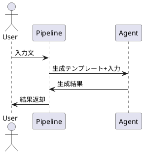
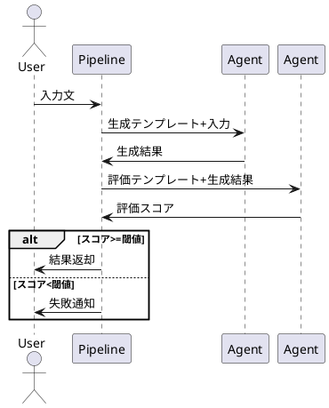
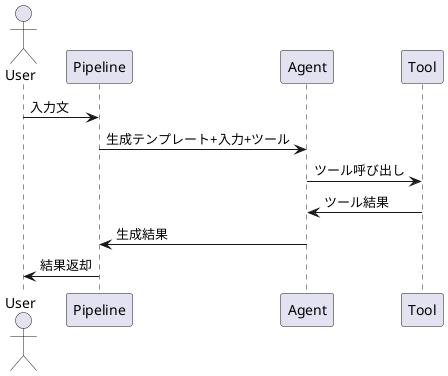
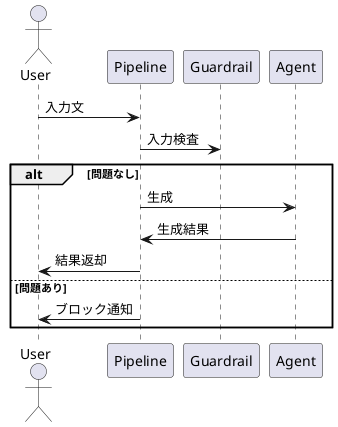

# 機能仕様書

## 1. シンプルな生成
- ユースケース手順
  1. ユーザーが入力文を与える
  2. Pipelineが生成テンプレートをもとにLLMで生成
  3. 結果を返す
- ユースケースフロー図

## 2. 生成物の評価付き生成
- ユースケース手順
  1. ユーザーが入力文を与える
  2. Pipelineが生成テンプレートで生成
  3. Pipelineが評価テンプレートで評価
  4. 評価スコアが閾値以上なら結果返却、未満ならリトライor失敗
- ユースケースフロー図

## 3. ツール連携
- ユースケース手順
  1. ユーザーが入力文を与える
  2. Pipelineがツール付きで生成
  3. 必要に応じてツール関数が呼ばれる
  4. 結果を返す
- ユースケースフロー図

## 4. ガードレール（入力ガードレール）
- ユースケース手順
  1. ユーザーが入力文を与える
  2. Pipelineがガードレール関数で入力検査
  3. 問題なければ生成、問題あればブロック
- ユースケースフロー図

---

## 参考
- 詳細なコード例は [docs/pipeline_examples.md](pipeline_examples.md) を参照。 