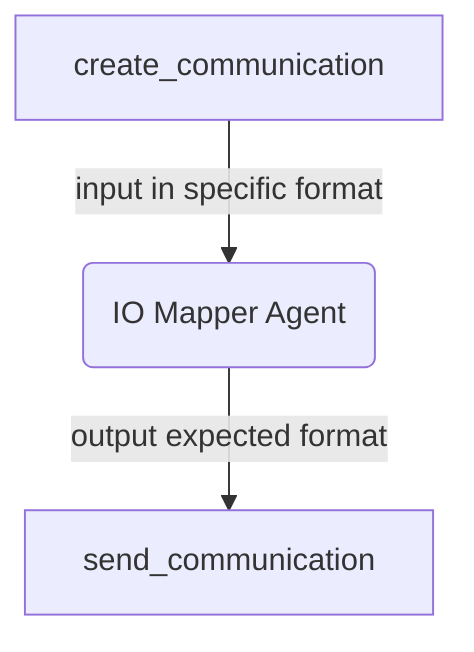

# IO-Mapper Agent

[](https://github.com/agntcy/acp-sdk/blob/main/CODE_OF_CONDUCT.md)

## About The Project

When connecting agents in an application, the output of one agent needs to be compatible with the input of the following agent. This compatibility needs to be guaranteed at three different levels:

1. transport level: the two agents need to use the same transport protocol.
2. format level: the two agents need to carry information using the same format (e.g. same JSON data structures)
3. semantic level: the two agents need to “talk about the same thing”.

Communication between agents is not possible if there are discrepancies between the agents at any of the layers [1-3].

Ensuring that agents are semantically compatible, i.e., the output of the one agent contains the information needed
by later agents, is an problem of composition or planning in the application. This project, the IO Mapper Agent,
addresses level 2 and 3 compatibility. It is a component, implemented as an agent, that can make use of an LLM
to transform the output of one agent to become compatible to the input of another agent. Note that this may mean
many different things, for example:

- JSON structure transcoding: A JSON dictionary needs to be remapped into another JSON dictionary
- Text summarisation: A text needs to be summarised or some information needs to be removed
- Text translation: A text needs to be translated from one language to another
- Text manipulation: Part of the information of one text needs to be reformulated into another text
- Any combination of the above

The IO mapper Agent can be fed the schema definitions of inputs and outputs as defined by the [Agent Connect Protocol](https://github.com/agntcy/acp-spec).

## Getting Started

To get a local copy up and running, follow the steps below.

### Prerequisites

- [Poetry](https://python-poetry.org/)
- [cmake](https://cmake.org/)

### Installation

1. Clone the repository

   ```sh
   git clone https://github.com/agntcy/iomapper-agnt.git
   ```

## Usage

There are several different ways to leverage the IO Mapper functions in Python. There
is an [agentic interface](#use-agent-io-mapper) using models that can be invoked on
different AI platforms and an [imperative interface](#use-imperative--deterministic-io-mapper)
that does deterministic JSON remapping without using any AI models.

## Key Features

The IO Mapper Agent uses an LLM to transform the inputs (typically the output of an
agent) to match the desired output (typically the input of another agent). As such,
it additionally supports specifying the model prompts for the translation. The configuration
object provides a specification for the system and default user prompts:

This project supports specifying model interactions using [LangGraph](https://langchain-ai.github.io/langgraph/).

## How to Use the IO Mapper Agent

> **Note**:
> For each example, the detailed process of creating agents and configuring the respective multi-agent software is omitted. Instead, only the essential steps for configuring and integrating the IO Mapper Agent are presented.

## How to use the Agent IO mapping

:warning:<b> For each example, the detailed process of creating agents and configuring the respective multi-agent software is omitted. Instead, only the essential steps for configuring and integrating the IO mapper agent are presented.</b>

## LangGraph

We support usages with both LangGraph state defined with TypedDict or as a Pydantic object

### Entities

<details>
<summary><h4>Expand to better understand the IOMappingAgentMetadata Interface</h4></summary>
   
## IOMappingAgentMetadata model Interface
<table>
    <tr>
        <th>Field</th>
        <th>Description</th>
        <th>Required</th>
        <th>Example</th>
    </tr>
    <tr>
        <td>input_fields</td>
        <td>An array of json paths and or instances of FieldMetadata.</td>
        <td>:white_check_mark:</td>
<td>

`["state.fiedl1", "state.field2", FieldMetadata(json_path="state", description="this is a list of items")]`

</td>
    </tr>
    <tr>
        <td>output_fields</td>
        <td>An array of json paths and or instances of FieldMetadata.</td>
        <td>:white_check_mark:</td>
<td>

`["state.output_fiedl1"]`

</td>
    </tr>
    <tr>
        <td>input_schema</td>
        <td>Defines the schema of the input data.</td>
        <td> :heavy_minus_sign: </td>
        <td>
            
```json
{ 
    "type": "object",
    "properties": {
        "title": {"type": "string"},
        "ingredients": {"type": "array", "items": {"type": "string"}},
        "instructions": {"type": "string"},
    },
    "required": ["title", "ingredients, instructions"],
}
```
<hr />
OR

```python
from pydantic import TypeAdapter
TypeAdapter(GraphState).json_schema()
```

</td>
    </tr>
    <tr>
        <td>output_schema</td>
        <td>Defines the schema for the output data.</td>
        <td>:heavy_minus_sign:</td>
        <td>same as input_schema</td>
    </tr>
</table>
</details>

<details>
<summary><h4>IOMappingAgent</h4></summary>

## IOMappingAgent model

<table>
    <tr>
        <th>Field</th>
        <th>Description</th>
        <th>Required</th>
        <th>Example</th>
    </tr>
    <tr>
        <td>metadata</td>
        <td>Instance of IOMappingAgentMetadata.</td>
        <td>:white_check_mark:</td>
<td>
            
```python
IOMappingAgentMetadata(
    input_fields=["documents.0.page_content"],
    output_fields=["recipe"],
    input_schema=TypeAdapter(GraphState).json_schema(),
    output_schema={
        "type": "object",
        "properties": {
            "title": {"type": "string"},
            "ingredients": {"type": "array", "items": {"type": "string"}},
            "instructions": {"type": "string"},
        },
        "required": ["title", "ingredients, instructions"],
    },
)
```
 </td>
</tr>

<tr>
    <td>llm</td>
    <td>An instance of the large language model to be used.</td>
    <td>:white_check_mark:</td>
<td>
    
```python
        AzureChatOpenAI(
            model=model_version,
            api_version=api_version,
            seed=42,
            temperature=0,
        )
```
</td>
</tr>
</table>
</details>

### LangGraph Example 1

This example involves a multi-agent software system designed to process a create engagement campaign and share within an organization. It interacts with an agent specialized in creating campaigns, another agent specialized in identifying suitable users. The information is then relayed to an IO mapper, which converts the list of users and the campaign details to present statistics about the campaign.

#### Define an agent io mapper metadata

```python
metadata = IOMappingAgentMetadata(
    input_fields=["selected_users", "campaign_details.name"],
    output_fields=["stats.status"],
)

```

The above instruction directs the IO mapper agent to utilize the `selected_users` and `name` from the `campaign_details` field and map them to the `stats.status`. No further information is needed since the type information can be derived from the input data which is a pydantic model.

:information_source: <i>Both input_fields and output_fields can also be sourced with a list composed of str and/or instances of FieldMetadata as the bellow example shows</i>:

```python
metadata = IOMappingAgentMetadata(
    input_fields=[
        FieldMetadata(
            json_path="selected_users", description="A list of users to be targeted"
        ),
        FieldMetadata(
            json_path="campaign_details.name",
            description="The name that can be used by the campaign",
            examples=["Campaign A"]
        ),
    ],
    output_fields=["stats"],
)
```

### Define an Instance of the Agent

```python
mapping_agent = IOMappingAgent(metadata=metadata, llm=llm)
```

### Add the node to the LangGraph graph

```python
workflow.add_node(
    "io_mapping",
    mapping_agent.langgraph_node,
)
```

### Add the Edge

With the edge added, you can run the your LangGraph graph.

```python
workflow.add_edge("create_communication", "io_mapping")
workflow.add_edge("io_mapping", "send_communication")
```

A flow chart of Io Mapper in a LangGraph graph of the discussed multi agent software discussed above



#### LangGraph Example 2

This example involves a multi-agent software system designed to process a list of ingredients. It interacts with an agent specialized in recipe books to identify feasible recipes based on the provided ingredients. The information is then relayed to an IO mapper, which converts it into a format suitable for display to the user.

### Define an Agent IO Mapper Metadata

```python
metadata = IOMappingAgentMetadata(
    input_fields=["documents.0.page_content"],
    output_fields=["recipe"],
    input_schema=TypeAdapter(GraphState).json_schema(),
    output_schema={
        "type": "object",
        "properties": {
            "title": {"type": "string"},
            "ingredients": {"type": "array", "items": {"type": "string"}},
            "instructions": {"type": "string"},
        },
        "required": ["title", "ingredients, instructions"],
    },
)
```

### Define an Instance of the Agent

```python
mapping_agent = IOMappingAgent(metadata=metadata, llm=llm)
```

### Add the node to the LangGraph graph

```python
graph.add_node(
    "recipe_io_mapper",
    mapping_agent.langgraph_node,
)
```

### Add the Edge

With the edge added, you can run the your LangGraph graph.

```
graph.add_edge("recipe_expert", "recipe_io_mapper")
```

## LlamaIndex

We support both LlamaIndex Workflow and the new AgentWorkflow multi agent software

### Entities

<details>
   <summary>IOMappingInputEvent</summary>
   
   ## IOMappingInputEvent event received by io mapper step
   <table>
      <tr>
         <td>Property</td>
         <td>Description</td>
         <td>Required</td>
         <td>Value Example</td>
      </tr>
      <tr>
         <td>metadata</td>
         <td>Object used to describe the input fields, output fields schema and any relevant information to be used in the mapping</td>
         <td>:white_check_mark:</td>
      <td>

```python
IOMappingAgentMetadata(
    input_fields=["selected_users", "campaign_details.name"],
    output_fields=["stats"],
)
```

   </td>
   </tr>
   <tr>
         <td>config</td>
         <td>Object containing information such as the llm instance that will be used to perform the translation</td>
         <td>:white_check_mark:</td>
      <td>

```python
LLamaIndexIOMapperConfig(llm=llm)
```

   </td>
   </tr>
   <tr>
         <td>data</td>
         <td>Represents the input data to be used in the translation</td>
         <td>:white_check_mark:</td>
      <td>

```python
OverallState(campaign_details=campaign_details, selected_users=ev.list_users),
```

   </td>
   </tr>
</table>
</details>

<details>
   <summary>IOMappingOutputEvent</summary>
   
   ## IOMappingOutputEvent event received by io mapper step
   <table>
      <tr>
         <td>Property</td>
         <td>Description</td>
         <td>Required</td>
         <td>Value Example</td>
      </tr>
      <tr>
         <td>mapping_result</td>
         <td>A dictionary containing the result of the mapping</td>
         <td>:white_check_mark:</td>
      <td>
         N/A
   </td>
   </tr>
   </table>

</details>

### Example of usage in a LlamaIndex workflow

In this example we recreate the campaign workflow using [LlamaIndex workflow](https://docs.llamaindex.ai/en/stable/module_guides/workflow/)

### Begin by importing the neccessary object

```python
from agntcy_iomapper import IOMappingAgent, IOMappingAgentMetadata
```

#### Define the workflow

```python
class CampaignWorkflow(Workflow):
    @step
    async def prompt_step(self, ctx: Context, ev: StartEvent) -> PickUsersEvent:
        await ctx.set("llm", ev.get("llm"))
        return PickUsersEvent(prompt=ev.get("prompt"))

    @step
    async def pick_users_step(
        self, ctx: Context, ev: PickUsersEvent
    ) -> CreateCampaignEvent:
        return CreateCampaignEvent(list_users=users)

    # The step that will trigger IO mapping
    @step
    async def create_campaign(
        self, ctx: Context, ev: CreateCampaignEvent
    ) -> IOMappingInputEvent:
        prompt = f"""
        You are a campaign builder for company XYZ. Given a list of selected users and a user prompt, create an engaging campaign.
        Return the campaign details as a JSON object with the following structure:
        {{
            "name": "Campaign Name",
            "content": "Campaign Content",
            "is_urgent": yes/no
        }}
        Selected Users: {ev.list_users}
        User Prompt: Create a campaign for all users
        """
        parser = PydanticOutputParser(output_cls=Campaign)
        llm = await ctx.get("llm", default=None)

        llm_response = llm.complete(prompt)
        try:
            campaign_details = parser.parse(str(llm_response))
            metadata = IOMappingAgentMetadata(
                input_fields=["selected_users", "campaign_details.name"],
                output_fields=["stats"],
            )
            config = LLamaIndexIOMapperConfig(llm=llm)

            io_mapping_input_event = IOMappingInputEvent(
                metadata=metadata,
                config=config,
                data=OverallState(
                    campaign_details=campaign_details,
                    selected_users=ev.list_users,
                ),
            )
            return io_mapping_input_event
        except Exception as e:
            print(f"Error parsing campaign details: {e}")
            return StopEvent(result=f"{e}")

    @step
    async def after_translation(self, evt: IOMappingOutputEvent) -> StopEvent:
        return StopEvent(result="Done")
```

It is important to notice:
The step create_campaign will trigger the IO mapper. Why?
Well, because:

1. It declares that it returns an instance of IOMappingInputEvent

```python
async def create_campaign(self, ctx: Context, ev: CreateCampaignEvent) -> IOMappingInputEvent:
```

2. And finally it creates and returns a valid instance of the IOMappingInputEvent

```python
# define an instance metadata
metadata = IOMappingAgentMetadata(
   input_fields=["selected_users", "campaign_details.name"],
   output_fields=["stats"]
)

#define an instance of config with must have an llm instance
config = LLamaIndexIOMapperConfig(llm=llm)

# Finally return define and return the IOMappingInputEvent
io_mapping_input_event = IOMappingInputEvent(
    metadata=metadata,
    config=config,
    data=OverallState(
        campaign_details=campaign_details,
        selected_users=ev.list_users,
    ),
)
return io_mapping_input_event
```

#### Add The IO mapper step

```python
    w = CampaignWorkflow()

    IOMappingAgent.as_worfklow_step(workflow=w)
```

### Example of usage in a LlamaIndex AgentWorkflow

In this example we recreate the recipe workflow using [LlamaIndex workflow](<[https://docs.llamaindex.ai/en/stable/module_guides/workflow/](https://docs.llamaindex.ai/en/stable/examples/agent/agent_workflow_multi/)>)

#### Import the necessary objects

```python
from agntcy_iomapper import FieldMetadata, IOMappingAgent, IOMappingAgentMetadata
```

#### Define an instance of the IOMappingAgentMetadata

```python
mapping_metadata = IOMappingAgentMetadata(
    input_fields=["documents.0.text"],
    output_fields=[
        FieldMetadata(
            json_path="recipe",
            description="this is a recipe for the ingredients you've provided",
        )
    ],
    input_schema=TypeAdapter(GraphState).json_schema(),
    output_schema={
        "type": "object",
        "properties": {
            "title": {"type": "string"},
            "ingredients": {"type": "array", "items": {"type": "string"}},
            "instructions": {"type": "string"},
        },
        "required": ["title", "ingredients, instructions"],
    },
)


```

#### Finally define the IOMappingAgent and add it to the AgentWorkflow.

Important to note that a tool is passed, to instruct the io mapper where to go next in the flow.

```
io_mapping_agent = IOMappingAgent.as_workflow_agent(
    mapping_metadata=mapping_metadata,
    llm=llm,
    name="IOMapperAgent",
    description="Useful for mapping a recipe document into recipe object",
    can_handoff_to=["Formatter_Agent"],
    tools=[got_to_format],
)


io_mapping_agent = IOMappingAgent.as_workflow_agent(
    mapping_metadata=mapping_metadata,
    llm=llm,
    name="IOMapperAgent",
    description="Useful for mapping a recipe document into recipe object",
    can_handoff_to=["Formatter_Agent"],
    tools=[got_to_format],
)

```

### Use Examples

1. Install:
   - [cmake](https://cmake.org/)
   - [pip](https://pip.pypa.io/en/stable/installation/)
2. From the `examples` folder run the desired make command, for example:

```shell
make make run_lg_eg_py
```

## Contributing

Contributions are what make the open source community such an amazing place to
learn, inspire, and create. Any contributions you make are **greatly
appreciated**. For detailed contributing guidelines, please see
[CONTRIBUTING.md](https://github.com/agntcy/acp-sdk/blob/main/docs/CONTRIBUTING.md)

## Copyright Notice and License

[Copyright Notice and License](https://github.com/agntcy/acp-sdk/blob/main/LICENSE)

Copyright (c) 2025 Cisco and/or its affiliates.

Licensed under the Apache License, Version 2.0 (the "License");
you may not use this file except in compliance with the License.
You may obtain a copy of the License at

       http://www.apache.org/licenses/LICENSE-2.0

Unless required by applicable law or agreed to in writing, software
distributed under the License is distributed on an "AS IS" BASIS,
WITHOUT WARRANTIES OR CONDITIONS OF ANY KIND, either express or implied.
See the License for the specific language governing permissions and
limitations under the License.
