# 🚀 AlgoSystem

[](https://badge.fury.io/py/algosystem)
[](https://www.python.org/downloads/)
[](https://www.gnu.org/licenses/gpl-3.0)
[](https://python-poetry.org/)

**A batteries-included Python library for algorithmic trading backtesting and beautiful, interactive dashboard visualization.**

Transform your trading strategy performance analysis with professional-grade dashboards that rivals institutional trading platforms.


---

## ✨ Features

- 🔄 **Simple Backtesting**: Run backtests with just a price series - no complex strategy definitions required
- 📊 **Interactive Dashboards**: Generate beautiful HTML dashboards with 20+ metrics and charts
- 🎨 **Visual Dashboard Editor**: Drag-and-drop interface for customizing dashboard layouts
- 📈 **Comprehensive Analytics**: Performance metrics, risk analysis, rolling statistics, and more
- 🆚 **Benchmark Comparison**: Compare strategies against market benchmarks with alpha/beta analysis
- ⚙️ **Flexible Configuration**: JSON-based system for complete dashboard customization
- 💻 **CLI Tools**: Command-line interface for quick dashboard generation
- 🌐 **Standalone Dashboards**: Export self-contained HTML files that work offline

---

## 📦 Installation

### Quick Install (Recommended)

```bash
pip install algosystem
```

### Development Installation

```bash
# Clone the repository
git clone https://github.com/yourusername/algosystem.git
cd algosystem

poetry install
```

### Requirements

- Python 3.9+
- pandas >= 2.0.0
- numpy >= 1.24.0
- Works on Windows, macOS, and Linux

---

## 🚀 Quick Start

### 1. Basic Backtesting

```python
import pandas as pd
from algosystem import Engine

# Load your strategy data (price series)
data = pd.read_csv('strategy_prices.csv', index_col=0, parse_dates=True)

# Run backtest and generate dashboard
engine = Engine(data)
results = engine.run()
dashboard_path = engine.generate_dashboard()

print(f"Dashboard ready: {dashboard_path}")
```

### 2. Using the CLI

```bash
# Generate dashboard from CSV
algosystem dashboard strategy_data.csv

# Launch visual dashboard editor
algosystem launch

# Create standalone dashboard
algosystem dashboard strategy_data.csv --output-file my_dashboard.html
```

### 3. Compare with Benchmark

```python
from algosystem import Engine

# Load strategy and benchmark data
strategy = pd.read_csv('strategy.csv', index_col=0, parse_dates=True)
benchmark = pd.read_csv('sp500.csv', index_col=0, parse_dates=True)

# Run comparison
engine = Engine(strategy, benchmark=benchmark)
results = engine.run()

# Results include alpha, beta, correlation, etc.
print(f"Alpha: {results['metrics']['alpha']:.4f}")
print(f"Beta: {results['metrics']['beta']:.4f}")
print(f"Sharpe Ratio: {results['metrics']['sharpe_ratio']:.4f}")
```

---

## 📚 Complete Usage Guide

### Understanding Your Data

AlgoSystem works with **price series** (portfolio values over time), not individual trades or signals.

#### Data Format Requirements

Your CSV should look like this:

```
Date,Portfolio_Value
2020-01-01,100000.00
2020-01-02,100150.25
2020-01-03,99875.50
...
```

#### Loading Data

```python
import pandas as pd

# From CSV
data = pd.read_csv('portfolio.csv', index_col=0, parse_dates=True)

# From pandas DataFrame
dates = pd.date_range('2020-01-01', periods=1000, freq='D')
prices = 100 * (1 + pd.Series(returns)).cumprod()
data = pd.Series(prices, index=dates)

# From multiple columns (use first column)
data = pd.read_csv('multi_column.csv', index_col=0, parse_dates=True)
strategy_data = data['Portfolio_Value']  # Select specific column
```

### Core Engine Features

#### 1. Basic Backtesting

```python
from algosystem import Engine

# Initialize engine
engine = Engine(
    data=portfolio_series,
    start_date='2020-01-01',      # Optional: filter date range
    end_date='2023-12-31',        # Optional: filter date range
    initial_capital=100000        # Optional: set starting capital
)

# Run backtest
results = engine.run()

# Access results
print(f"Total Return: {results['metrics']['total_return']:.2%}")
print(f"Sharpe Ratio: {results['metrics']['sharpe_ratio']:.2f}")
print(f"Max Drawdown: {results['metrics']['max_drawdown']:.2%}")
```

#### 2. Benchmark Analysis

```python
# Compare against benchmark
engine = Engine(strategy_data, benchmark=benchmark_data)
results = engine.run()

# Benchmark-specific metrics
benchmark_metrics = {
    'alpha': results['metrics']['alpha'],
    'beta': results['metrics']['beta'],
    'correlation': results['metrics']['correlation'],
    'tracking_error': results['metrics']['tracking_error'],
    'information_ratio': results['metrics']['information_ratio']
}
```

#### 3. Dashboard Generation

```python
# Generate full dashboard
dashboard_path = engine.generate_dashboard(
    output_dir='./my_dashboard',
    open_browser=True,              # Auto-open in browser
    config_path='custom_config.json'  # Use custom layout
)

# Generate standalone dashboard
standalone_path = engine.generate_standalone_dashboard(
    'portfolio_analysis.html'
)
```

### Advanced Usage

#### Custom Dashboard Configuration

Create a `dashboard_config.json`:

```json
{
  "metrics": [
    {
      "id": "total_return",
      "type": "Percentage",
      "title": "Total Return",
      "value_key": "total_return",
      "position": {"row": 0, "col": 0}
    },
    {
      "id": "sharpe_ratio",
      "type": "Value",
      "title": "Sharpe Ratio",
      "value_key": "sharpe_ratio",
      "position": {"row": 0, "col": 1}
    }
  ],
  "charts": [
    {
      "id": "equity_curve",
      "type": "LineChart",
      "title": "Portfolio Growth",
      "data_key": "equity_curve",
      "position": {"row": 1, "col": 0},
      "config": {
        "y_axis_label": "Portfolio Value ($)",
        "percentage_format": false
      }
    },
    {
      "id": "monthly_returns",
      "type": "HeatmapTable",
      "title": "Monthly Returns",
      "data_key": "monthly_returns",
      "position": {"row": 1, "col": 1},
      "config": {}
    }
  ],
  "layout": {
    "max_cols": 2,
    "title": "My Custom Dashboard"
  }
}
```

#### Working with Returns vs Prices

```python
# If you have returns instead of prices
returns_series = pd.read_csv('returns.csv', index_col=0, parse_dates=True)

# Convert to price series
initial_value = 100000
price_series = initial_value * (1 + returns_series).cumprod()

# Run backtest
engine = Engine(price_series)
results = engine.run()
```

#### Risk Analysis

```python
# Access detailed risk metrics
risk_metrics = {
    'volatility': results['metrics']['annualized_volatility'],
    'var_95': results['metrics']['var_95'],
    'cvar_95': results['metrics']['cvar_95'],
    'max_drawdown': results['metrics']['max_drawdown'],
    'sortino_ratio': results['metrics']['sortino_ratio'],
    'calmar_ratio': results['metrics']['calmar_ratio']
}

# Rolling metrics for time series analysis
rolling_data = results['plots']
rolling_sharpe = rolling_data['rolling_sharpe']
rolling_volatility = rolling_data['rolling_volatility']
drawdown_series = rolling_data['drawdown_series']
```

### CLI Reference

#### Dashboard Commands

```bash
# Basic dashboard generation
algosystem dashboard portfolio.csv

# With custom output location
algosystem dashboard portfolio.csv --output-dir ./results

# Standalone dashboard
algosystem dashboard portfolio.csv --output-file analysis.html

# Include benchmark comparison
algosystem dashboard portfolio.csv --benchmark sp500.csv

# Use custom configuration
algosystem dashboard portfolio.csv --config custom_layout.json
```

#### Dashboard Editor

```bash
# Launch web-based editor
algosystem launch

# Launch on specific port
algosystem launch --port 8080

# Load existing configuration
algosystem launch --config existing_config.json

# Save configuration to specific location
algosystem launch --save-config ./configs/my_layout.json
```

#### Configuration Management

```bash
# Create new configuration file
algosystem create-config my_config.json

# View configuration contents
algosystem show-config my_config.json

# List all configurations
algosystem list-configs
```

---

## 🛠️ Developer Tutorial

### Understanding the Architecture

AlgoSystem follows a modular architecture designed for extensibility:

```
┌─────────────────────────────────────────────────────────────┐
│                    AlgoSystem Architecture                  │
└─────────────────────────────────────────────────────────────┘

┌─────────────────┐    ┌─────────────────┐    ┌─────────────────┐
│   Data Input    │    │   Engine Core   │    │   Dashboard     │
│                 │    │                 │    │   Generator     │
│ • CSV Files     │ ── │ • Backtesting   │ ── │ • HTML Export   │
│ • Pandas Series │    │ • Metrics Calc  │    │ • Standalone    │
│ • Price Data    │    │ • Risk Analysis │    │ • Interactive   │
└─────────────────┘    └─────────────────┘    └─────────────────┘
         │                       │                      │
         │              ┌─────────────────┐             │
         │              │   Analysis      │             │
         │              │   Modules       │             │
         │              │                 │             │
         └────────────▶│ • Performance   │◀────────────┘
                        │ • Risk          │
                        │ • Portfolio     │
                        └─────────────────┘
                                 │
                        ┌─────────────────┐
                        │   Web Editor    │
                        │                 │
                        │ • Flask App     │
                        │ • Drag & Drop   │
                        │ • Live Preview  │
                        └─────────────────┘
```

### Core Components

#### 1. Engine Class (`algosystem.backtesting.Engine`)

The main interface for backtesting:

```python
class Engine:
    def __init__(self, data, benchmark=None, start_date=None, 
                 end_date=None, initial_capital=None):
        """
        Initialize backtesting engine.
        
        Parameters:
        -----------
        data : pd.Series or pd.DataFrame
            Portfolio price series
        benchmark : pd.Series, optional
            Benchmark price series for comparison
        start_date : str or datetime, optional
            Start date for analysis
        end_date : str or datetime, optional
            End date for analysis
        initial_capital : float, optional
            Initial portfolio value
        """
        
    def run(self) -> dict:
        """Run backtest and return results."""
        
    def generate_dashboard(self, output_dir=None, 
                          config_path=None) -> str:
        """Generate interactive HTML dashboard."""
```

#### 2. Metrics Module (`algosystem.analysis.metrics`)

Comprehensive performance calculations:

```python
# Key functions
def calculate_metrics(strategy, benchmark=None) -> dict:
    """Calculate static performance metrics."""
    
def calculate_time_series_data(strategy, benchmark=None) -> dict:
    """Calculate rolling metrics and time series."""
    
def rolling_sharpe(returns, window=30) -> pd.Series:
    """Calculate rolling Sharpe ratio."""
```

#### 3. Dashboard Generator (`algosystem.backtesting.dashboard`)

Creates interactive visualizations:

```python
def generate_dashboard(engine, output_dir=None, 
                      config_path=None) -> str:
    """Generate complete dashboard with configuration."""
    
def generate_standalone_dashboard(engine, output_path=None) -> str:
    """Create self-contained HTML file."""
```

### Creating Custom Metrics

Add your own performance metrics:

```python
# In algosystem/analysis/custom_metrics.py
def calculate_custom_metric(returns):
    """Calculate a custom performance metric."""
    # Your custom calculation here
    return custom_value

# Register with the system
from algosystem.analysis.metrics import calculate_metrics

# Extend the metrics function
original_calculate_metrics = calculate_metrics

def enhanced_calculate_metrics(strategy, benchmark=None):
    metrics = original_calculate_metrics(strategy, benchmark)
    
    # Add custom metric
    returns = strategy.pct_change().dropna()
    metrics['custom_metric'] = calculate_custom_metric(returns)
    
    return metrics

# Replace the original function
algosystem.analysis.metrics.calculate_metrics = enhanced_calculate_metrics
```

### Extending Dashboard Components

#### Custom Chart Types

Create new visualization types:

```python
# In algosystem/backtesting/dashboard/charts/custom_chart.py
def create_custom_chart(data, config):
    """Create a custom chart component."""
    return {
        'type': 'CustomChart',
        'data': format_data_for_chart(data),
        'config': config
    }

# Register in available_components.py
AVAILABLE_CHARTS.append({
    "id": "custom_chart",
    "type": "CustomChart",
    "title": "My Custom Chart",
    "data_key": "custom_data",
    "description": "Description of custom chart",
    "category": "custom"
})
```

#### Custom Metrics

Add new metric types:

```python
# In available_components.py
AVAILABLE_METRICS.append({
    "id": "my_metric",
    "type": "Percentage",
    "title": "My Custom Metric",
    "value_key": "my_custom_metric",
    "description": "Description of my metric",
    "category": "custom"
})
```

### Plugin Architecture

Create plugins for AlgoSystem:

```python
# Create a plugin file: algosystem_plugin_example.py
class AlgoSystemPlugin:
    def __init__(self):
        self.name = "Example Plugin"
        self.version = "1.0.0"
    
    def register_metrics(self):
        """Register custom metrics."""
        return {
            'plugin_metric': self.calculate_plugin_metric
        }
    
    def register_charts(self):
        """Register custom charts."""
        return {
            'plugin_chart': self.create_plugin_chart
        }
    
    def calculate_plugin_metric(self, data):
        """Custom metric calculation."""
        return data.std() * 252 ** 0.5
    
    def create_plugin_chart(self, data, config):
        """Custom chart creation."""
        return {
            'type': 'PluginChart',
            'data': data.to_dict(),
            'config': config
        }

# Use the plugin
plugin = AlgoSystemPlugin()
# Register plugin with AlgoSystem...
```

### Testing Your Extensions

Create tests for custom components:

```python
# tests/test_custom_metrics.py
import pytest
import pandas as pd
import numpy as np
from algosystem.analysis.custom_metrics import calculate_custom_metric

def test_custom_metric():
    # Create test data
    dates = pd.date_range('2020-01-01', periods=100)
    returns = pd.Series(np.random.normal(0.001, 0.02, 100), index=dates)
    
    # Test metric calculation
    result = calculate_custom_metric(returns)
    
    # Assertions
    assert isinstance(result, float)
    assert not np.isnan(result)
    assert result > 0  # or whatever makes sense for your metric

# Run tests
# pytest tests/test_custom_metrics.py
```

### Performance Optimization

#### Efficient Data Processing

```python
# Use vectorized operations
def efficient_rolling_calculation(data, window=252):
    """Efficient rolling calculation using pandas."""
    return data.rolling(window).apply(
        lambda x: x.std() * np.sqrt(252), 
        raw=True  # Use raw numpy arrays for speed
    )

# Cache expensive calculations
from functools import lru_cache

@lru_cache(maxsize=128)
def cached_complex_calculation(data_hash, window):
    """Cache expensive calculations."""
    # Complex calculation here
    pass
```

#### Memory Management

```python
# Process large datasets in chunks
def process_large_dataset(data, chunk_size=10000):
    """Process large datasets efficiently."""
    results = []
    
    for i in range(0, len(data), chunk_size):
        chunk = data.iloc[i:i+chunk_size]
        result = process_chunk(chunk)
        results.append(result)
        
        # Clean up memory
        del chunk
        
    return pd.concat(results)
```

### Best Practices

#### 1. Error Handling

```python
def robust_metric_calculation(data):
    """Calculate metric with proper error handling."""
    try:
        if data.empty:
            return 0.0
            
        if len(data) < 30:
            logger.warning("Insufficient data for metric calculation")
            return np.nan
            
        result = calculate_metric(data)
        
        if np.isnan(result) or np.isinf(result):
            return 0.0
            
        return result
        
    except Exception as e:
        logger.error(f"Error calculating metric: {e}")
        return np.nan
```

#### 2. Configuration Validation

```python
def validate_dashboard_config(config):
    """Validate dashboard configuration."""
    required_fields = ['metrics', 'charts', 'layout']
    
    for field in required_fields:
        if field not in config:
            raise ValueError(f"Missing required field: {field}")
    
    # Validate metrics
    for metric in config['metrics']:
        if 'id' not in metric:
            raise ValueError("Metric missing required 'id' field")
        if 'position' not in metric:
            raise ValueError(f"Metric {metric['id']} missing position")
    
    return True
```

#### 3. Logging

```python
import logging

# Set up logging
logger = logging.getLogger('algosystem')
handler = logging.StreamHandler()
formatter = logging.Formatter(
    '%(asctime)s - %(name)s - %(levelname)s - %(message)s'
)
handler.setFormatter(formatter)
logger.addHandler(handler)
logger.setLevel(logging.INFO)

# Use throughout your code
logger.info("Starting backtest...")
logger.warning("Low data quality detected")
logger.error("Failed to calculate metric")
```

---

## 🎨 Visual System Overview

### Data Flow Diagram

```mermaid
graph TD
    A["Portfolio Data<br/>CSV/DataFrame"] --> B["Engine.run()"]
    B --> C["Metrics Calculation"]
    B --> D["Time Series Analysis"]
    B --> E["Risk Assessment"]
    
    C --> F["Performance Metrics<br/>• Total Return<br/>• Sharpe Ratio<br/>• Max Drawdown"]
    D --> G["Rolling Analytics<br/>• Rolling Sharpe<br/>• Rolling Volatility<br/>• Drawdown Series"]
    E --> H["Risk Metrics<br/>• VaR/CVaR<br/>• Skewness<br/>• Sortino Ratio"]
    
    F --> I["Dashboard Generator"]
    G --> I
    H --> I
    
    I --> J["Configuration<br/>dashboard_config.json"]
    J --> K["HTML Dashboard<br/>Interactive Charts<br/>& Metrics"]
    
    L["Benchmark Data<br/>Optional"] --> B
    M["Custom Config<br/>Optional"] --> J
```



### Dashboard Component Architecture


### CLI Command Structure


### Metric Categories Visualization


### Chart Types Available

| Chart Type | Description | Use Case |
|------------|-------------|----------|
| 📈 **Line Chart** | Time series visualization | Equity curves, rolling metrics |
| 🔥 **Heatmap Table** | Color-coded data grid | Monthly/yearly returns |
| 📊 **Bar Chart** | Categorical comparisons | Annual performance |
| 🌊 **Area Chart** | Filled line charts | Drawdown visualization |
| 📉 **Candlestick** | OHLC price data | Market analysis (future) |

### Color Scheme & Styling

```css
/* AlgoSystem Color Palette */
:root {
  --primary-blue: #2E86AB;
  --success-green: #2ECC71;
  --warning-orange: #F39C12;
  --danger-red: #E74C3C;
  --dark-gray: #2C3E50;
  --light-gray: #ECF0F1;
  --purple: #9B59B6;
  --teal: #1ABC9C;
}

/* Positive/Negative Indicators */
.positive { color: var(--success-green); }
.negative { color: var(--danger-red); }

/* Chart Colors */
.equity-curve { color: var(--primary-blue); }
.drawdown { color: var(--danger-red); }
.rolling-metrics { color: var(--purple); }
.benchmark { color: var(--teal); }
```

---

## 🤝 Contributing

We welcome contributions! Please see our [Contributing Guide](CONTRIBUTING.md) for details.

### Quick Start for Contributors

```bash
# Fork and clone
git clone https://github.com/yourusername/algosystem.git
cd algosystem

# Set up development environment
poetry install --with dev

# Run tests
pytest

# Run linting
black algosystem tests
flake8 algosystem tests

# Start development server
poetry run algosystem launch --debug
```

---

## 📄 License

MIT License - see [LICENSE](LICENSE) file for details.

---

## 🔗 Links & Resources

- 📦 **PyPI Package**: [pypi.org/project/algosystem](https://pypi.org/project/algosystem)
- 📚 **Documentation**: [algosystem.readthedocs.io](https://algosystem.readthedocs.io)
- 🐙 **GitHub Repository**: [github.com/yourusername/algosystem](https://github.com/yourusername/algosystem)
- 🐛 **Issue Tracker**: [github.com/yourusername/algosystem/issues](https://github.com/yourusername/algosystem/issues)
- 💬 **Discussions**: [github.com/yourusername/algosystem/discussions](https://github.com/yourusername/algosystem/discussions)

---

## 🏆 Acknowledgments

Built with ❤️ for the algorithmic trading community.

Special thanks to:
- [QuantStats](https://github.com/ranaroussi/quantstats) for inspiration on metrics
- [Plotly](https://plotly.com/) for interactive charting capabilities
- [Flask](https://flask.palletsprojects.com/) for the web-based editor
- The Python finance community for continuous feedback and contributions

---

*Happy trading! 📈*
