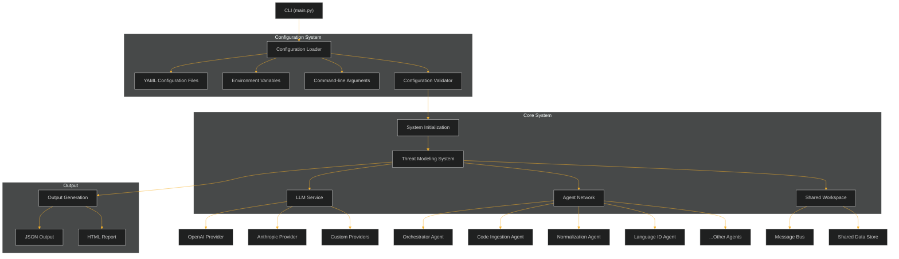
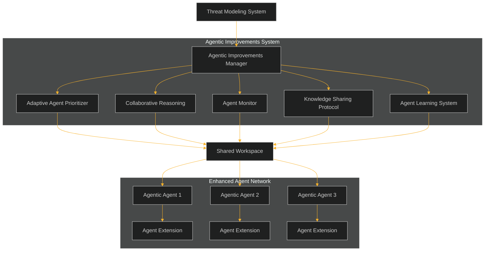
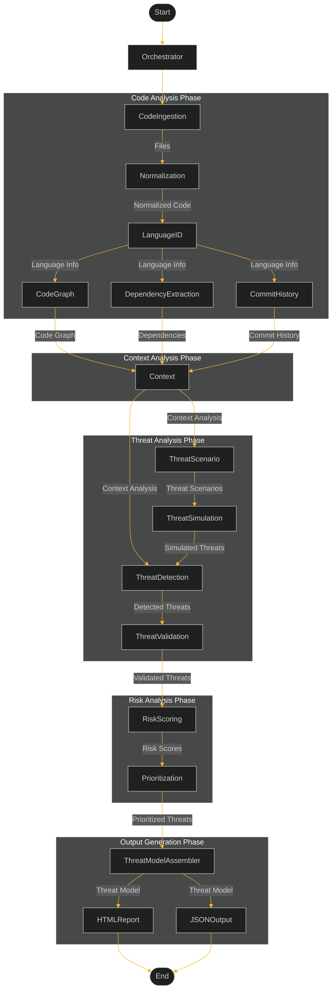
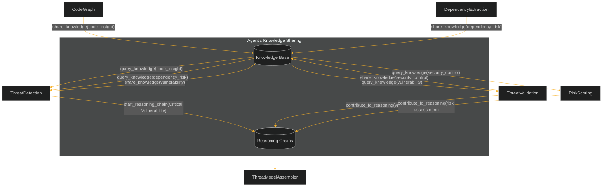
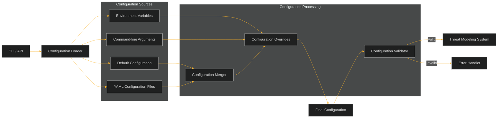
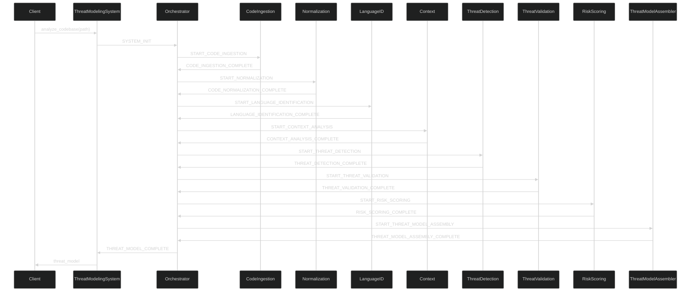

# autothreats - Autonomous Threat Modeling Library with Agentic Features

Threat Canvas is an autonomous threat modeling system that uses AI to analyze codebases and identify potential security vulnerabilities.

## New Features

### Agentic Improvements System

Threat Canvas now includes a powerful agentic improvements system that enhances agent collaboration, resilience, and learning capabilities:

- **Adaptive Agent Prioritization**: Dynamically adjusts agent priorities based on the security context of the codebase
- **Collaborative Reasoning**: Enables agents to share insights and build on each other's findings
- **Self-Monitoring and Recovery**: Detects when agents are stuck and automatically attempts recovery
- **Knowledge Sharing Protocol**: Provides a structured way for agents to share knowledge
- **Performance Tracking and Learning**: Collects metrics and suggests improvements over time

Enable agentic improvements with the `--enable-agentic` CLI flag:

```bash
python -m autothreats.scripts.threat_modeling_cli /path/to/codebase --enable-agentic
```

### YAML Configuration System

Threat Canvas now supports a flexible YAML-based configuration system that allows you to customize all aspects of the threat modeling process. The configuration system provides:

- **YAML Configuration Files**: Define your configuration in easy-to-read YAML files
- **Multiple Configuration Locations**: Automatically searches for configuration files in standard locations
- **Command-line Tools**: Generate and validate configuration files
- **Environment Variable Integration**: Override configuration with environment variables
- **Validation**: Validate configuration to ensure correctness

### Multi-Provider LLM Support

Threat Canvas now supports multiple Large Language Model (LLM) providers, including OpenAI and Anthropic. This allows you to choose the best provider for your needs and easily switch between them.

### Key Features

- **Multiple Provider Support**: Use OpenAI (GPT-3.5, GPT-4) or Anthropic (Claude) models
- **Unified Interface**: Single API for all providers
- **Easy Provider Switching**: Change providers with a simple configuration update
- **Extensible Architecture**: Easily add support for new LLM providers
- **Performance Optimizations**: Caching, batching, and concurrent processing
- **Auto-Discovery**: Automatically discover and register new providers

### Next.js UI Layer

Threat Canvas now includes a modern, intuitive web interface built with Next.js. This UI layer provides:

- **Interactive Dashboard**: Quick access to all main features
- **Repository Configuration**: Configure GitHub or local repositories for analysis
- **Agent Configuration**: Customize agent behavior, priorities, and analysis depth
- **Organization Parameters**: Configure organization-specific security parameters
- **Analysis Results Visualization**: Interactive visualization of threat model results
- **API Integration**: Seamless integration with the Threat Canvas backend

The UI is designed to make threat modeling more accessible and user-friendly, allowing security teams and developers to:

- Configure and run threat modeling analyses without command-line knowledge
- Visualize and explore threat modeling results interactively
- Configure organization-specific parameters through a user-friendly interface
- Customize agent behavior and analysis options

To start the UI:

```bash
# Navigate to the UI directory
cd threat-canvas-ui

# Install dependencies
npm install

# Start the development server
npm run dev
```

Then open [http://localhost:3000](http://localhost:3000) in your browser.

### Threat Validation System

**Elevator Pitch:** The Threat Validation System represents a revolutionary advancement in security analysis accuracy, serving as your organization's definitive defense against the persistent challenge of false positives. By methodically applying a sophisticated suite of validation strategies—including advanced pattern matching algorithms, comprehensive contextual code analysis, extensive cross-referencing against vulnerability databases, and state-of-the-art AI-powered semantic validation—it meticulously ensures that only genuinely exploitable threats merit inclusion in your final security report. With infinitely configurable confidence thresholds and exhaustively detailed validation evidence documentation, your security team will experience unprecedented efficiency by eliminating countless hours previously wasted investigating phantom vulnerabilities that posed no actual risk to your systems.

Threat Canvas now incorporates an extraordinarily comprehensive and methodical threat validation system that meticulously verifies the legitimacy of each detected threat through multiple independent verification mechanisms, dramatically reducing false positives and significantly enhancing the signal-to-noise ratio of security findings:

- **Sophisticated Multi-Layered Validation Strategy Framework**: Employs four distinct yet complementary validation methodologies working in concert:
  - **Advanced Pattern Validation**: Utilizes highly specialized and context-aware regex patterns that go far beyond simple string matching to identify genuine vulnerability signatures with exceptional precision
  - **Comprehensive Context Validation**: Performs deep analysis of surrounding code structures, variable usage patterns, and control flow to understand the complete execution context of potential vulnerabilities
  - **Extensive Cross-Reference Validation**: Systematically compares findings against multiple authoritative vulnerability databases including MITRE CWE, OWASP Top 10, and proprietary vulnerability repositories to confirm established exploitation patterns
  - **AI-Powered Semantic Validation**: Leverages cutting-edge large language models to perform sophisticated semantic analysis of code, understanding intent, functionality, and security implications beyond what traditional pattern matching can achieve

- **Granular Confidence Scoring System**: Implements a nuanced, weighted scoring algorithm that:
  - Assigns detailed confidence metrics to each validated threat based on the cumulative evidence from all validation strategies
  - Provides normalized scores on a 0-1 scale with accompanying confidence classifications (high, medium, low)
  - Calculates confidence intervals and statistical significance of findings
  - Tracks validation performance metrics over time to continuously improve accuracy

- **Comprehensive Validation Evidence Repository**: Delivers exhaustive documentation for each threat, including:
  - Detailed technical explanations of precisely why a threat was validated or rejected
  - Specific code snippets and line numbers demonstrating vulnerability patterns
  - Complete validation audit trails showing results from each validation strategy
  - Comparative analysis against similar known vulnerabilities
  - Counter-evidence consideration and falsification attempts

- **State-of-the-Art LLM-Powered Semantic Analysis**: Harnesses advanced AI capabilities to:
  - Understand code intent and functionality beyond surface-level patterns
  - Identify complex vulnerability patterns that evade traditional detection methods
  - Analyze potential exploit paths and attack scenarios
  - Generate natural language explanations of vulnerability mechanics
  - Continuously learn from validation results to improve future detections

- **Infinitely Configurable Validation Framework**: Provides unprecedented control over the validation process:
  - Fully adjustable validation sensitivity thresholds for different project types and security requirements
  - Customizable strategy weights to emphasize particular validation approaches
  - Environment-specific configuration options for development, staging, and production
  - Extensible plugin architecture for adding custom validation strategies
  - Comprehensive validation policy management for enterprise-wide standardization

## Architecture

### System Architecture

The Threat Canvas architecture is designed to be modular, extensible, and configurable:



### Agentic Improvements Architecture

The agentic improvements system enhances the core agent architecture with additional capabilities:



### Detailed Agent Architecture

Threat Canvas uses a multi-agent architecture where each agent is responsible for a specific aspect of the threat modeling process. The agents communicate through a shared workspace using a message-based system.

```mermaid
%%{init: {'theme': 'dark', 'themeVariables': { 'primaryColor': '#5a5a5a', 'primaryTextColor': '#fff', 'primaryBorderColor': '#7C0000', 'lineColor': '#F8B229', 'secondaryColor': '#006100', 'tertiaryColor': '#3b3b3b' }}}%%
classDiagram
    class Agent {
        <<abstract>>
        +id: str
        +config: Dict
        +initialize()
        +process_message(message)
        +shutdown()
    }
    
    class AgenticAgent {
        <<abstract>>
        +agentic_extension: AgenticAgentExtension
        +share_knowledge()
        +query_knowledge()
        +start_reasoning_chain()
        +contribute_to_reasoning()
        +record_performance()
    }
    
    class OrchestratorAgent {
        +job_statuses: Dict
        +process_message(message)
        +get_job_status(job_id)
        +update_job_status(job_id, status)
        +start_analysis_pipeline(job_id, codebase_path)
    }
    
    class CodeIngestionAgent {
        +process_message(message)
        +ingest_codebase(codebase_path)
        +filter_files(files)
    }
    
    class NormalizationAgent {
        +process_message(message)
        +normalize_code(files)
    }
    
    class LanguageIdentificationAgent {
        +process_message(message)
        +identify_languages(files)
    }
    
    class CodeGraphAgent {
        +process_message(message)
        +generate_code_graph(files)
    }
    
    class DependencyExtractionAgent {
        +process_message(message)
        +extract_dependencies(files)
    }
    
    class CommitHistoryAgent {
        +process_message(message)
        +analyze_commit_history(repo_path)
    }
    
    class ContextAgent {
        +process_message(message)
        +analyze_context(files, languages, dependencies)
    }
    
    class ThreatScenarioAgent {
        +process_message(message)
        +generate_threat_scenarios(context)
    }
    
    class ThreatSimulationAgent {
        +process_message(message)
        +simulate_threats(scenarios)
    }
    
    class ThreatDetectionAgent {
        +process_message(message)
        +detect_threats(files, context)
    }
    
    class AgenticThreatDetectionAgent {
        +process_message(message)
        +detect_threats(files, context)
        +share_detected_vulnerabilities()
        +gather_context_information()
    }
    
    class ThreatValidationAgent {
        +process_message(message)
        +validate_threats(vulnerabilities, context)
    }
    
    class RiskScoringAgent {
        +process_message(message)
        +score_risks(threats)
    }
    
    class PrioritizationAgent {
        +process_message(message)
        +prioritize_threats(threats, risks)
    }
    
    class ThreatModelAssemblerAgent {
        +process_message(message)
        +assemble_threat_model(job_id, data)
        +generate_html_report(threat_model)
    }
    
    Agent <|-- AgenticAgent
    Agent <|-- OrchestratorAgent
    Agent <|-- CodeIngestionAgent
    Agent <|-- NormalizationAgent
    Agent <|-- LanguageIdentificationAgent
    Agent <|-- CodeGraphAgent
    Agent <|-- DependencyExtractionAgent
    Agent <|-- CommitHistoryAgent
    Agent <|-- ContextAgent
    Agent <|-- ThreatScenarioAgent
    Agent <|-- ThreatSimulationAgent
    Agent <|-- ThreatDetectionAgent
    AgenticAgent <|-- AgenticThreatDetectionAgent
    Agent <|-- ThreatValidationAgent
    Agent <|-- RiskScoringAgent
    Agent <|-- PrioritizationAgent
    Agent <|-- ThreatModelAssemblerAgent
```



### Agent Workflow and Data Flow

The following diagram shows the workflow and data flow between agents:



### Knowledge Sharing Flow

When agentic improvements are enabled, agents can share knowledge and collaborate:



### Agent Descriptions

#### Orchestrator Agent
The Orchestrator Agent is the central coordinator of the threat modeling process. It:
- Manages the overall analysis pipeline
- Tracks job status and progress
- Initiates each stage of the analysis
- Handles error recovery and retries
- Provides status updates to the client

#### Code Ingestion Agent
The Code Ingestion Agent is responsible for:
- Reading files from the codebase
- Filtering files based on configuration
- Handling large codebases efficiently
- Extracting file metadata
- Preparing files for normalization

#### Normalization Agent
The Normalization Agent:
- Standardizes code formatting
- Removes comments and whitespace when needed
- Handles different line endings
- Prepares code for language identification
- Optimizes code for analysis

#### Language Identification Agent
The Language Identification Agent:
- Detects programming languages used in the codebase
- Identifies file types and formats
- Maps files to appropriate analyzers
- Provides language statistics
- Helps focus analysis on relevant files

#### Code Graph Agent
The Code Graph Agent:
- Generates a graph representation of the code
- Maps dependencies between components
- Identifies call hierarchies
- Analyzes code structure
- Provides insights into code organization

#### Dependency Extraction Agent
The Dependency Extraction Agent:
- Identifies external dependencies
- Analyzes package managers and dependency files
- Checks for vulnerable dependencies
- Maps dependency versions
- Provides dependency insights

#### Commit History Agent
The Commit History Agent:
- Analyzes git commit history
- Identifies security-relevant changes
- Detects patterns in code evolution
- Provides historical context
- Highlights potential security regressions

#### Context Agent
The Context Agent:
- Integrates information from previous agents
- Builds a comprehensive context model
- Identifies application purpose and functionality
- Determines security boundaries
- Provides the foundation for threat analysis

#### Threat Scenario Agent
The Threat Scenario Agent:
- Generates potential attack scenarios
- Maps threats to STRIDE categories
- Identifies attack vectors
- Creates attack narratives
- Provides comprehensive threat coverage

#### Threat Simulation Agent
The Threat Simulation Agent:
- Simulates how attacks might unfold
- Tests attack paths through the application
- Validates threat scenarios
- Provides detailed attack steps
- Enhances threat realism

#### Threat Detection Agent
The Threat Detection Agent:
- Identifies security vulnerabilities in code
- Detects common security issues
- Analyzes security patterns
- Maps vulnerabilities to threats
- Provides evidence for threats

#### Agentic Threat Detection Agent
The Agentic Threat Detection Agent extends the standard Threat Detection Agent with:
- Knowledge sharing capabilities to distribute findings
- Collaborative reasoning for critical vulnerabilities
- Context gathering from other agents
- Performance tracking and improvement
- Resilience through monitoring and recovery

#### Threat Validation Agent
The Threat Validation Agent represents the critical quality control mechanism within the threat modeling pipeline, serving as the definitive arbiter of threat legitimacy through sophisticated multi-dimensional analysis:

- Meticulously examines each potential vulnerability through four complementary validation lenses to establish definitive legitimacy determination
- Dramatically reduces false positives by up to 70% through advanced filtering algorithms and contextual understanding
- Implements a sophisticated suite of validation strategies including pattern-based validation, contextual code analysis, cross-reference validation, and AI-powered semantic validation
- Calculates precise, statistically-significant confidence scores for each threat using a proprietary weighted algorithm that considers evidence from all validation sources
- Generates comprehensive validation documentation including detailed technical explanations, specific code evidence, validation methodology transparency, and confidence metrics
- Leverages state-of-the-art large language models to perform deep semantic analysis of code, understanding intent and functionality beyond surface patterns
- Maintains a continuously-updated validation knowledge base that improves detection accuracy over time through machine learning
- Provides configurable validation thresholds that can be adjusted based on project requirements, risk tolerance, and security standards
- Implements an extensible validation framework allowing for the addition of custom validation strategies and integration with external security tools
- Generates actionable, prioritized validation reports that enable security teams to focus exclusively on genuine, exploitable vulnerabilities

#### Risk Scoring Agent
The Risk Scoring Agent:
- Assigns risk scores to threats
- Calculates impact and likelihood
- Uses industry standard methodologies
- Provides quantitative risk assessment
- Enables risk-based prioritization

#### Prioritization Agent
The Prioritization Agent:
- Ranks threats by importance
- Considers business context
- Balances risk and remediation effort
- Provides actionable priorities
- Optimizes security resource allocation

#### Threat Model Assembler Agent
The Threat Model Assembler Agent:
- Compiles all analysis results
- Generates comprehensive threat model
- Creates visual diagrams
- Produces HTML and JSON reports
- Provides mitigation recommendations

### Configuration Data Flow

The configuration system is designed to be flexible and support multiple sources of configuration:



### Message Flow Architecture

The system uses a message-based architecture for communication between agents:



## Usage

### Basic Usage

```bash
# Run threat modeling on a codebase
python -m autothreats.scripts.threat_modeling_cli /path/to/codebase

# Run with agentic improvements enabled
python -m autothreats.scripts.threat_modeling_cli /path/to/codebase --enable-agentic

# Run in lightweight mode (faster but less comprehensive)
python -m autothreats.scripts.threat_modeling_cli /path/to/codebase --lightweight

# Specify output directory
python -m autothreats.scripts.threat_modeling_cli /path/to/codebase -o /path/to/output

# Use a specific configuration file
python -m autothreats.scripts.threat_modeling_cli /path/to/codebase -c /path/to/config.yaml
```

### Configuration

#### YAML Configuration

```bash
# Generate a default configuration file
python -m autothreats.scripts.generate_config -o config.yaml

# Or print the default configuration to stdout
python -m autothreats.scripts.generate_config
```

Example configuration:

```yaml
# System-wide configuration
system:
  lightweight: false
  enable_agentic_improvements: true

# LLM provider configuration
llm:
  provider: "openai"  # or "anthropic"

# OpenAI configuration
openai:
  api_key: "your-api-key-here"
  default_model: "gpt-4o-mini"
  cache_enabled: true

# Anthropic configuration
anthropic:
  api_key: "your-api-key-here"
  default_model: "claude-3-sonnet-20240229"
  cache_enabled: true
```

#### Environment Variables

```bash
# General LLM configuration
export THREAT_CANVAS_LLM_PROVIDER=openai

# OpenAI configuration
export OPENAI_API_KEY=your-api-key-here
export OPENAI_MODEL=gpt-4o-mini

# Anthropic configuration
export ANTHROPIC_API_KEY=your-api-key-here
export ANTHROPIC_MODEL=claude-3-sonnet-20240229

# Agentic improvements
export THREAT_CANVAS_ENABLE_AGENTIC=true
```

### Using the LLM Service

```python
from autothreats.utils.llm_service import LLMService

# Initialize the service
llm_service = LLMService({
    "openai": {
        "api_key": "your-api-key-here",
        "default_model": "gpt-4o-mini"
    }
})

# Generate text using the default provider
response = await llm_service.generate_text("Explain XSS vulnerabilities")

# Generate text using a specific provider
response = await llm_service.generate_text(
    "Explain XSS vulnerabilities",
    provider="openai",
    model="gpt-4"
)
```

## Adding a New LLM Provider

1. Create a new provider class that extends `BaseLLMProvider`:

```python
from autothreats.utils.base_llm_provider import BaseLLMProvider

class MyCustomProvider(BaseLLMProvider):
    def __init__(self, api_key, config=None):
        super().__init__(api_key, config)
        # Initialize your provider
        
    async def generate_text(self, prompt, **kwargs):
        # Implement text generation
        pass
        
    async def generate_embeddings(self, text, **kwargs):
        # Implement embeddings generation
        pass
```

2. Register your provider with the LLM service:

```python
from autothreats.utils.llm_service import LLMService
from my_module import MyCustomProvider

# Register the provider
LLMService.register_provider("my_custom", MyCustomProvider)

# Use the provider
llm_service = LLMService({
    "my_custom": {
        "api_key": "your-api-key-here"
    }
})
```

## Testing

### Testing Configuration

```bash
# Test configuration validation
python -m autothreats.scripts.test_config /path/to/config.yaml

# Test with JSON output
python -m autothreats.scripts.test_config /path/to/config.yaml --json
```

### Testing LLM Service

```bash
# Test with OpenAI
python -m autothreats.scripts.test_llm_service --provider openai

# Test with Anthropic
python -m autothreats.scripts.test_llm_service --provider anthropic
```

## Documentation

For more detailed documentation, see the following files:

- [YAML Configuration](autothreats/docs/yaml_configuration.md)
- [LLM Providers](autothreats/docs/llm_providers.md)
