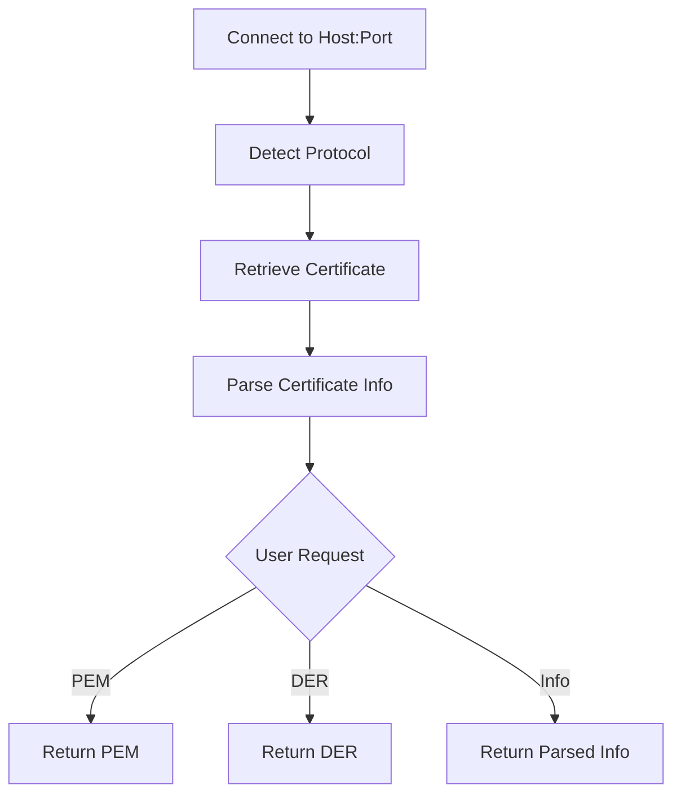

# Basic Usage

CertMonitor makes it easy to retrieve and validate SSL/TLS certificates for any host. Below is a minimal example, followed by more details and example outputs.

## Minimal Example

```python
from certmonitor import CertMonitor

with CertMonitor("example.com") as monitor:
    cert_data = monitor.get_cert_info()
    validation_results = monitor.validate()
    print(cert_data)
    print(validation_results)
```

---

## Certificate Retrieval & Info Extraction (Mermaid Diagram)



---

## Example Output: Certificate Info

This is a sample of the structured certificate info returned by `get_cert_info()`:

```json
{
  "subject": {
    "countryName": "US",
    "stateOrProvinceName": "California",
    "localityName": "Los Angeles",
    "organizationName": "Internet Corporation for Assigned Names and Numbers",
    "commonName": "www.example.com"
  },
  "issuer": {
    "countryName": "US",
    "organizationName": "DigiCert Inc",
    "commonName": "DigiCert Global G2 TLS RSA SHA256 2020 CA1"
  },
  "version": 3,
  "serialNumber": "075BCEF30689C8ADDF13E51AF4AFE187",
  "notBefore": "2024-01-30T00:00:00",
  "notAfter": "2025-03-01T23:59:59",
  "subjectAltName": {
    "DNS": [
      "www.example.com",
      "example.com"
    ],
    "IP Address": []
  },
  "OCSP": [
    "http://ocsp.digicert.com"
  ],
  "caIssuers": [
    "http://cacerts.digicert.com/DigiCertGlobalG2TLSRSASHA2562020CA1-1.crt"
  ],
  "crlDistributionPoints": [
    "http://crl3.digicert.com/DigiCertGlobalG2TLSRSASHA2562020CA1-1.crl",
    "http://crl4.digicert.com/DigiCertGlobalG2TLSRSASHA2562020CA1-1.crl"
  ]
}
```

---

## Example Output: Validation Results

This is a sample of the validation results returned by `validate()`:

```json
{
  "expiration": {
    "is_valid": true,
    "days_to_expiry": 120,
    "expires_on": "2025-03-01T23:59:59",
    "warnings": []
  },
  "subject_alt_names": {
    "is_valid": true,
    "sans": {"DNS": ["www.example.com", "example.com"], "IP Address": []},
    "count": 2,
    "contains_host": {"name": "www.example.com", "is_valid": true, "reason": "Matched DNS SAN"},
    "contains_alternate": {"example.com": {"name": "example.com", "is_valid": true, "reason": "Matched DNS SAN"}},
    "warnings": []
  }
}
```

---

## Output Explanation

- The certificate info is a dictionary with details about the subject, issuer, validity, SANs, and revocation endpoints.
- The validation results are a dictionary keyed by validator name, each with a structured result (see [Validators](../validators/index.md) for details).

---

## More Examples

### Getting Cipher Info

You can also retrieve cipher suite information:

```python
with CertMonitor("example.com") as monitor:
    cipher_info = monitor.get_cipher_info()
    print(cipher_info)
```

Sample output:

```json
{
  "cipher_suite": {
    "name": "TLS_AES_256_GCM_SHA384",
    "encryption_algorithm": "AES-256-GCM",
    "message_authentication_code": "AEAD",
    "key_exchange_algorithm": "Not applicable (TLS 1.3 uses ephemeral key exchange by default)"
  },
  "protocol_version": "TLSv1.3",
  "key_bit_length": 256
}
```

---

> **Tip:** See the [Usage Guide](index.md) for more advanced examples, including custom validators, error handling, and retrieving raw PEM/DER formats.
