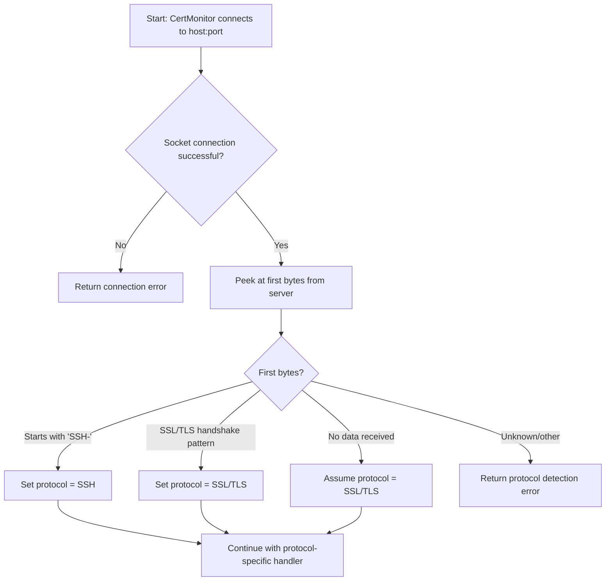
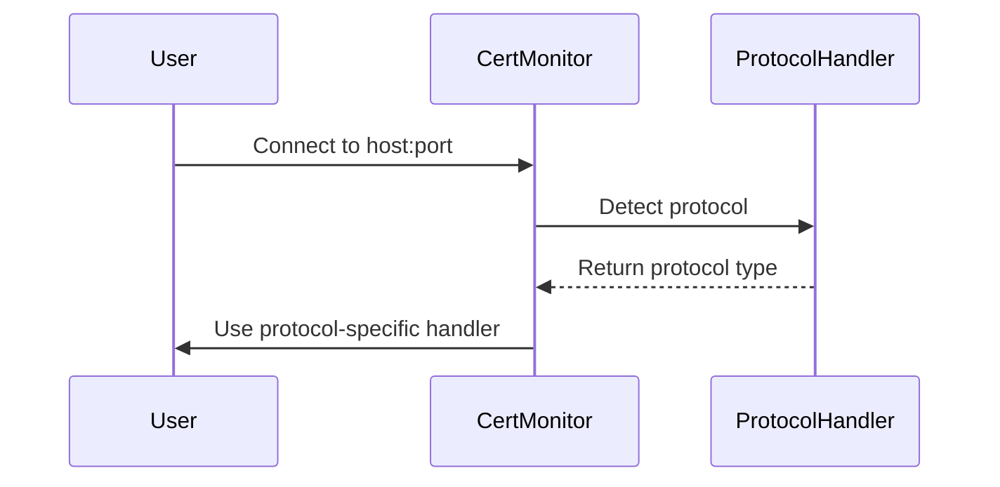

# Protocol Detection

CertMonitor automatically detects the protocol used by the target host and port. This allows you to use the same API for both SSL/TLS and (in the future) SSH endpoints.

## How Protocol Detection Works

When you create a `CertMonitor` instance and connect to a host, CertMonitor:

1. Attempts to open a socket connection to the host and port.
2. Peeks at the first few bytes sent by the server:
   - If the bytes start with `SSH-`, the protocol is detected as SSH.
   - If the bytes match common SSL/TLS handshake patterns, the protocol is detected as SSL/TLS.
   - If no data is received, CertMonitor assumes SSL/TLS by default (since many servers wait for a handshake).
3. If the protocol cannot be determined, CertMonitor returns a structured error.

## Protocol Detection Flow (Mermaid Diagram)



## Protocol Handler Selection (Mermaid Sequence Diagram)



## Example

```python
from certmonitor import CertMonitor

with CertMonitor("example.com", port=443) as monitor:
    print(monitor.protocol)  # 'ssl'

with CertMonitor("my-ssh-server.example.com", port=22) as monitor:
    print(monitor.protocol)  # 'ssh' (if supported)
```

---

## Current Support and Roadmap

- **SSL/TLS**: Full support for certificate retrieval, validation, and cipher info.
- **SSH**: Protocol detection is implemented, but robust SSH certificate/key validation is coming soon. Future versions will allow you to:
  - Retrieve SSH host keys
  - Validate SSH key types, fingerprints, and algorithms
  - Integrate with SSH CA and trust models

If you try to use SSL/TLS-specific features on an SSH endpoint, CertMonitor will return a clear error message.

---

> **Tip:** You can always check the detected protocol via `monitor.protocol` and handle different protocols in your own code if needed.
