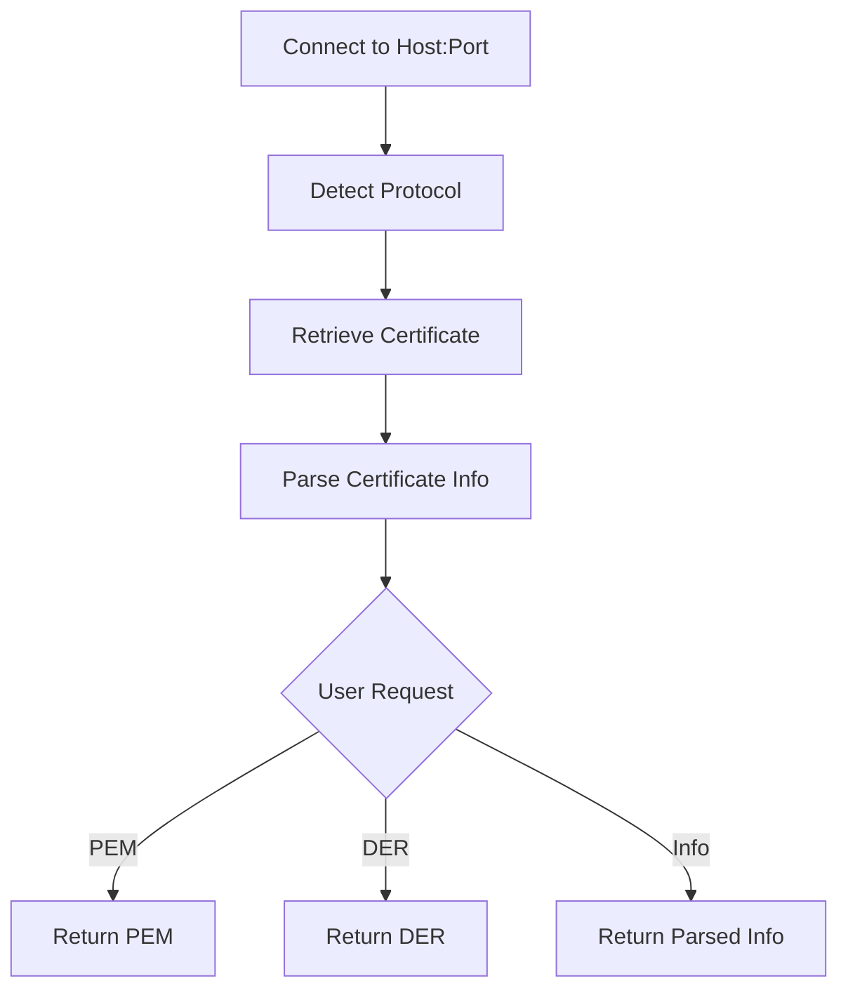

# Retrieving Raw Certificate Data

CertMonitor allows you to retrieve the raw certificate in both PEM and DER formats for any host.

## Get PEM Format

PEM is a base64-encoded, human-readable format commonly used for certificate files.

```python
from certmonitor import CertMonitor

with CertMonitor("example.com") as monitor:
    pem = monitor.get_raw_pem()
    print(pem)
```

### Example Output

```pem
-----BEGIN CERTIFICATE-----
MIID...snip...IDAQAB
-----END CERTIFICATE-----
```

---

## Get DER Format

DER is a binary format (often used in low-level APIs or for cryptographic operations).

```python
with CertMonitor("example.com") as monitor:
    der = monitor.get_raw_der()
    print(der)  # This will print bytes; you may want to base64-encode for display
```

### Example Output (base64-encoded for readability)

```text
MIID...snip...IDAQAB
```

---

## Certificate Retrieval & Info Extraction (Mermaid Diagram)



---

## When to Use Each Format

- **PEM**: Use for most file-based operations, OpenSSL, and human inspection.
- **DER**: Use for binary APIs, cryptographic libraries, or when a raw byte array is required.

---

> **Tip:** You can always convert between PEM and DER using OpenSSL or Python's cryptography library if needed.
