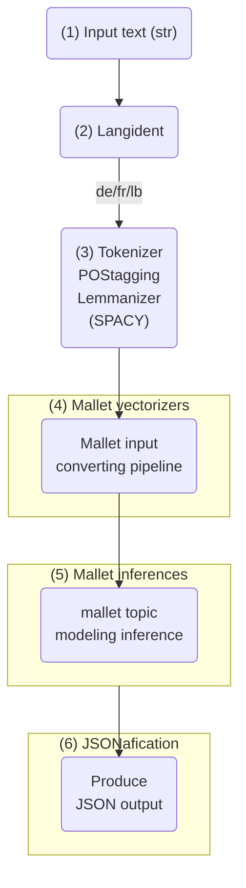

## Exaplanation of LDATopics Pipeline

### Diagram

### 1. Input Text (str)
The pipeline starts with a text input in string format. This could be any textual data that needs to be analyzed.

### 2. Langident (Language Identification)
The system uses a language identification tool to detect the language of the input text. Based on the output, the text is classified as German (`de`), French (`fr`), or Luxembourgish (`lb`).

### 3. Tokenizer, POS Tagging, and Lemmatization (Using SpaCy)
Once the language is identified, the text undergoes several preprocessing steps:
- **Tokenization**: The text is split into individual words.
- **Part-of-Speech (POS) Tagging**: Words are assigned grammatical categories (e.g., noun, verb, adjective).
- **Lemmatization**: Words are reduced to their base form (e.g., *running* → *run*).

Output is a list of lemmatized tokens: `['ein', 'klein', 'Hund', 'namens', 'Max', 'leben', 'in', 'ein', 'ruhig', 'Dorf', ...]`

### 4. Mallet Vectorizers
The processed text is converted into a format suitable for MALLET topic modeling. This step likely includes **text vectorization**, where words are transformed into numerical representations.

### 5. Mallet Inferences
MALLET applies **topic modeling**, typically using **Latent Dirichlet Allocation (LDA)** or another probabilistic model. The system infers **topics** from the text.

### 6. JSONification
The topic modeling results are formatted into **JSON output**. This output is likely structured with **topic distributions, keywords, and document-topic probabilities**, making it easier to use for downstream applications.


## LDA Topics Example
Make sure you have installed the package as demostrated in the main README. 

```python
# Initialize the pipeline
ldatopics_pipeline = LDATopicsPipeline()

# Example text extracted from OCR
de_text = "Ein kleiner Hund namens Max lebte in einem ruhigen Dorf. Jeden Tag rannte er durch die Straßen und spielte mit den Kindern. Eines Tages fand er einen geheimen Garten, den niemand kannte. Max entschied sich, den Garten zu erkunden und entdeckte viele schöne Blumen und Tiere. Von diesem Tag an besuchte er den Garten jeden Nachmittag."
     

# Get an answer
result = ldatopics_pipeline(de_text)
print(result)
```
**Expected Output:**
```
[{'uid': 'doc3',
  'ts': '2025-05-10T10:42:12Z',
  'language': 'de',
  'topic_count': 100,
  'topics': [{'t': 'tm-de-all-v2.0_tp87_de', 'p': 0.202},
   {'t': 'tm-de-all-v2.0_tp33_de', 'p': 0.108},
   {'t': 'tm-de-all-v2.0_tp30_de', 'p': 0.097},
   {'t': 'tm-de-all-v2.0_tp65_de', 'p': 0.064},
   {'t': 'tm-de-all-v2.0_tp59_de', 'p': 0.052},
   {'t': 'tm-de-all-v2.0_tp80_de', 'p': 0.052},
   {'t': 'tm-de-all-v2.0_tp02_de', 'p': 0.03},
   {'t': 'tm-de-all-v2.0_tp31_de', 'p': 0.03},
   {'t': 'tm-de-all-v2.0_tp66_de', 'p': 0.03}],
  'min_p': 0.02,
  'topic_model_id': 'tm-de-all-v2.0',
  'topic_model_description': 'https://huggingface.co/impresso-project/mallet-topic-inferencer/resolve/main/models/tm/tm-de-all-v2.0.topic_model_topic_description.jsonl.bz2'}]
```

For a more details about the usage and the possibilities that this pipeline provides, please check out our demo [notebook](https://github.com/impresso/impresso-datalab-notebooks/blob/main/annotate/ldatopics_pipeline_demo.ipynb). 