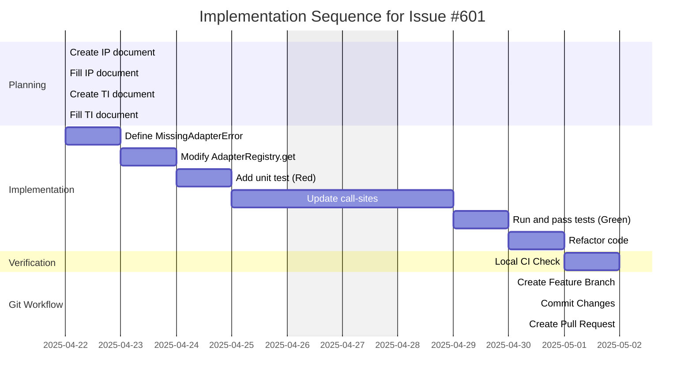

# Guidance

**Purpose** Plan out the entire coding effort before writing code. Clarify
**phases**, **tasks**, dependencies, test strategy, and acceptance criteria.

**When to Use**

- After design is approved, before actual implementation starts.

**Best Practices**

- Include TDD approach details (e.g., required test coverage).
- Provide a clear sequence of tasks.
- Reference external docs or prior designs.

---

# Implementation Plan: Raise MissingAdapterError on AdapterRegistry.get() (Issue #601)

## 1. Overview

### 1.1 Component Purpose

This plan addresses Issue #601, which aims to improve the robustness of
`AdapterRegistry.get()` by replacing the return of `None` for unknown keys with
a specific exception. This will make debugging easier and explicitly signal when
an expected adapter is not found.

### 1.2 Design Reference

This implementation plan follows the requirements outlined in GitHub Issue #601
(https://github.com/khive-ai/lionagi/issues/601).

### 1.3 Implementation Approach

The implementation will follow a TDD approach. We will first create a test that
expects `MissingAdapterError` to be raised. This test will initially fail (Red
phase). Then, we will implement the exception and modify `AdapterRegistry.get()`
to make the test pass (Green phase). Finally, we will refactor the code and
update existing call-sites to handle the new exception, ensuring all tests pass
and the codebase is clean (Refactor phase).

## 2. Implementation Phases

### 2.1 Phase 1: Setup and Red Test

Description: Create the new exception class and write the failing test case to
establish the requirement.

**Key Deliverables:**

- `lionagi.exceptions.MissingAdapterError` class defined.
- Unit test for `AdapterRegistry.get("bogus_key")` added to test suite.
- Test execution showing the new test failing.

**Dependencies:**

- None

**Estimated Complexity:** Low

### 2.2 Phase 2: Implement and Green Test

Description: Modify `AdapterRegistry.get()` to raise the new exception and
ensure the previously failing test now passes.

**Key Deliverables:**

- `AdapterRegistry.get()` modified to raise `MissingAdapterError`.
- Test execution showing the new test passing.

**Dependencies:**

- Phase 1 completed.

**Estimated Complexity:** Low

### 2.3 Phase 3: Update Call-Sites and Refactor

Description: Identify and update all existing code that calls
`AdapterRegistry.get()` to handle the new exception appropriately. Refactor code
for clarity and maintainability.

**Key Deliverables:**

- All call-sites of `AdapterRegistry.get()` updated.
- All existing and new tests passing.
- Codebase reviewed and refactored.

**Dependencies:**

- Phase 2 completed.

**Estimated Complexity:** Medium

## 3. Test Strategy

### 3.1 Unit Tests

#### 3.1.1 Test Group: AdapterRegistry

| ID   | Description                                                               | Fixtures/Mocks    | Assertions                                |
| ---- | ------------------------------------------------------------------------- | ----------------- | ----------------------------------------- |
| UT-1 | Test that `AdapterRegistry.get("bogus_key")` raises `MissingAdapterError` | `AdapterRegistry` | `MissingAdapterError` exception is raised |
| UT-2 | Ensure existing tests for valid `get()` calls still pass                  | Existing fixtures | Existing assertions remain valid          |

### 3.2 Integration Tests

No new integration tests are required for this specific change, as the
modification is internal to the `AdapterRegistry` and its direct consumers.
Existing integration tests that rely on `AdapterRegistry.get()` will serve to
validate that the updated call-sites handle the exception correctly.

### 3.3 Mock and Stub Requirements

No new mocks or stubs are required for this task.

## 4. Implementation Tasks

### 4.1 Core Changes

| ID  | Task                                                 | Description                                                                                         | Dependencies | Priority | Complexity |
| --- | ---------------------------------------------------- | --------------------------------------------------------------------------------------------------- | ------------ | -------- | ---------- |
| T-1 | Define `MissingAdapterError` exception               | Create the exception class in `lionagi/_errors.py`.                                                 | None         | High     | Low        |
| T-2 | Modify `AdapterRegistry.get()`                       | Change the method in `lionagi/_class_registry.py` to raise the exception.                           | T-1          | High     | Low        |
| T-3 | Add unit test for `AdapterRegistry.get("bogus_key")` | Write the test case in the appropriate test file (e.g., `tests/adapters/test_adapter_registry.py`). | T-1, T-2     | High     | Low        |
| T-4 | Identify and update call-sites                       | Search codebase for `AdapterRegistry.get()` and handle the new exception.                           | T-2          | High     | Medium     |
| T-5 | Run and pass all tests                               | Execute the test suite to ensure all tests pass.                                                    | T-3, T-4     | High     | Low        |
| T-6 | Refactor code                                        | Clean up implemented code and updated call-sites.                                                   | T-5          | Medium   | Low        |

## 5. Implementation Sequence



## 6. Acceptance Criteria

### 6.1 Component Level

| ID   | Criterion                                                                                 | Validation Method                                     |
| ---- | ----------------------------------------------------------------------------------------- | ----------------------------------------------------- |
| AC-1 | Accessing an unknown adapter key in `AdapterRegistry.get()` raises `MissingAdapterError`. | Unit test UT-1                                        |
| AC-2 | Existing functionality of `AdapterRegistry.get()` for known keys is preserved.            | Unit tests UT-2                                       |
| AC-3 | All call-sites of `AdapterRegistry.get()` handle the new exception correctly.             | Passing existing integration tests and manual review. |

### 6.2 API Level

No specific API-level acceptance criteria are directly introduced by this
change, as it is an internal modification.

## 7. Test Implementation Plan

### 7.1 Test Implementation Sequence

1. Create `tests/adapters/test_adapter_registry.py` if it doesn't exist.
2. Add a test function `test_get_raises_missingadaptererror_for_unknown_key`.
3. Implement the test logic using `pytest.raises(MissingAdapterError)`.

### 7.2 Test Code Examples

#### Unit Test Example (for UT-1)

```python
import pytest
from lionagi._class_registry import AdapterRegistry
from lionagi._errors import MissingAdapterError

def test_get_raises_missingadaptererror_for_unknown_key():
    """
    Test that AdapterRegistry.get() raises MissingAdapterError for an unknown key.
    """
    registry = AdapterRegistry()
    with pytest.raises(MissingAdapterError) as excinfo:
        registry.get("bogus_key")
    assert "Adapter for key 'bogus_key' not found" in str(excinfo.value)

# Additional tests will be added here to ensure existing functionality is preserved (UT-2).
```

## 8. Implementation Risks and Mitigations

| Risk                                     | Impact | Likelihood | Mitigation                                                                                                             |
| ---------------------------------------- | ------ | ---------- | ---------------------------------------------------------------------------------------------------------------------- |
| Missing some call-sites during update    | High   | Medium     | Use comprehensive code search, rely on CI tests catching unhandled exceptions, manual code review of relevant modules. |
| Unexpected side effects in existing code | Medium | Low        | Ensure comprehensive test coverage (unit and integration), run full CI suite locally before committing.                |

## 9. Dependencies and Environment

### 9.1 External Libraries

No new external libraries are required.

### 9.2 Environment Setup

Standard khive development environment setup (see README).

```bash
# Ensure khive is installed in editable mode
uv pip install -e .

# Run local CI checks
khive ci --check
```

## 10. Additional Resources

### 10.1 Reference Implementation

None directly, this is a new exception and behavior.

### 10.2 Relevant Documentation

- Python Exception Hierarchy: https://docs.python.org/3/library/exceptions.html
- `AdapterRegistry` documentation (to be updated after merge).

### 10.3 Design Patterns

- Exception Handling
- Registry Pattern
