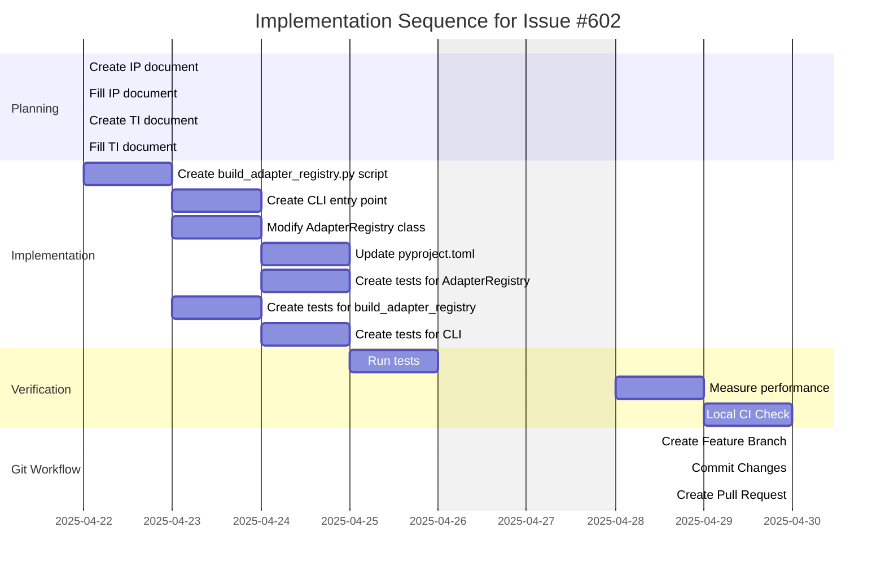

# Implementation Plan: Optimize Adapter Registry with Pre-computed Map (Issue #602)

## 1. Overview

### 1.1 Component Purpose

This implementation addresses Issue #602, which aims to optimize the adapter
registry loading process by pre-computing a static mapping of adapter keys to
their module paths. This will significantly reduce cold start times and
unnecessary disk I/O within worker processes.

### 1.2 Design Reference

This implementation plan follows the requirements outlined in GitHub Issue #602
(https://github.com/khive-ai/lionagi/issues/602).

### 1.3 Implementation Approach

The implementation follows a TDD approach with the following key components:

1. A CLI script (`build_adapter_registry.py`) that scans the `lionagi/adapters`
   directory and generates a static mapping of adapter keys to module paths.
2. Modifications to the `AdapterRegistry` class to prioritize loading from the
   pre-computed map if it exists.
3. A fallback mechanism to the dynamic scanning method if the map is not found.
4. Integration with the build process using hatch build hooks.

## 2. Implementation Phases

### 2.1 Phase 1: Create CLI Script

Description: Create a CLI script that walks the `lionagi/adapters` directory and
writes a static mapping of adapter keys to their module paths.

**Key Deliverables:**

- `lionagi/scripts/build_adapter_registry.py` script
- `lionagi/scripts/cli.py` entry point
- `lionagi/scripts/__init__.py` package file

**Dependencies:**

- None

**Estimated Complexity:** Medium

### 2.2 Phase 2: Modify AdapterRegistry

Description: Modify the `AdapterRegistry` class to prioritize loading from the
pre-computed map if it exists, with a fallback to the dynamic scanning method.

**Key Deliverables:**

- Updated `lionagi/adapters/adapter.py` file with modified `AdapterRegistry`
  class

**Dependencies:**

- Phase 1 completed

**Estimated Complexity:** Medium

### 2.3 Phase 3: Integrate with Build Process

Description: Integrate the build script into the build process using hatch build
hooks.

**Key Deliverables:**

- Updated `pyproject.toml` file with build hooks and CLI entry point

**Dependencies:**

- Phase 1 and 2 completed

**Estimated Complexity:** Low

### 2.4 Phase 4: Testing

Description: Create tests for the new functionality.

**Key Deliverables:**

- Updated `tests/adapters/test_adapter_registry.py` file
- New `tests/scripts/test_build_adapter_registry.py` file
- New `tests/scripts/test_cli.py` file

**Dependencies:**

- Phase 1, 2, and 3 completed

**Estimated Complexity:** Medium

## 3. Test Strategy

### 3.1 Unit Tests

#### 3.1.1 Test Group: AdapterRegistry

| ID   | Description                                                                    | Fixtures/Mocks                  | Assertions                                   |
| ---- | ------------------------------------------------------------------------------ | ------------------------------- | -------------------------------------------- |
| UT-1 | Test that `AdapterRegistry.get()` raises `MissingAdapterError` for unknown key | `AdapterRegistry`               | `MissingAdapterError` exception is raised    |
| UT-2 | Test that `AdapterRegistry.get()` returns registered adapter                   | `AdapterRegistry`, Mock adapter | Adapter is returned correctly                |
| UT-3 | Test that `AdapterRegistry` can load adapters from pre-computed map            | Temporary JSON file             | Adapter map is loaded correctly              |
| UT-4 | Test that `AdapterRegistry` can import adapters from pre-computed map          | Mock importlib                  | Adapter is imported and registered correctly |

#### 3.1.2 Test Group: build_adapter_registry

| ID   | Description                                                               | Fixtures/Mocks                     | Assertions                                |
| ---- | ------------------------------------------------------------------------- | ---------------------------------- | ----------------------------------------- |
| UT-5 | Test that `is_adapter_class()` correctly identifies adapter classes       | AST node                           | Function returns True for adapter classes |
| UT-6 | Test that `extract_obj_key()` correctly extracts obj_key value            | AST node                           | Function returns correct obj_key value    |
| UT-7 | Test that `find_adapter_classes()` finds adapter classes in a file        | Temporary file                     | Function returns correct adapter classes  |
| UT-8 | Test that `scan_adapters_directory()` scans directory for adapter classes | Temporary directory                | Function returns correct adapter map      |
| UT-9 | Test that `main()` function creates adapter map file                      | Temporary directory, Mock sys.argv | Adapter map file is created correctly     |

#### 3.1.3 Test Group: CLI

| ID    | Description                                                                | Fixtures/Mocks                                  | Assertions                   |
| ----- | -------------------------------------------------------------------------- | ----------------------------------------------- | ---------------------------- |
| UT-10 | Test that CLI `build-registry` command calls build_adapter_registry.main() | Mock sys.argv, Mock build_adapter_registry.main | Function is called correctly |

### 3.2 Integration Tests

No new integration tests are required for this specific change, as the unit
tests cover the functionality comprehensively.

### 3.3 Performance Tests

| ID   | Description                                  | Fixtures/Mocks | Assertions                 |
| ---- | -------------------------------------------- | -------------- | -------------------------- |
| PT-1 | Verify cold start time is reduced to < 300ms | None           | Cold start time is < 300ms |

## 4. Implementation Tasks

### 4.1 Core Changes

| ID  | Task                                    | Description                                                               | Dependencies | Priority | Complexity |
| --- | --------------------------------------- | ------------------------------------------------------------------------- | ------------ | -------- | ---------- |
| T-1 | Create build_adapter_registry.py script | Create a script to scan adapters directory and generate a static mapping. | None         | High     | Medium     |
| T-2 | Create CLI entry point                  | Create a CLI entry point for the build-registry command.                  | T-1          | High     | Low        |
| T-3 | Modify AdapterRegistry class            | Modify the AdapterRegistry class to use the pre-computed map.             | T-1          | High     | Medium     |
| T-4 | Update pyproject.toml                   | Add build hooks and CLI entry point to pyproject.toml.                    | T-1, T-2     | High     | Low        |
| T-5 | Create tests for AdapterRegistry        | Create tests for the modified AdapterRegistry class.                      | T-3          | High     | Medium     |
| T-6 | Create tests for build_adapter_registry | Create tests for the build_adapter_registry script.                       | T-1          | High     | Medium     |
| T-7 | Create tests for CLI                    | Create tests for the CLI entry point.                                     | T-2          | High     | Low        |

## 5. Implementation Sequence



## 6. Acceptance Criteria

### 6.1 Component Level

| ID   | Criterion                                                       | Validation Method            |
| ---- | --------------------------------------------------------------- | ---------------------------- |
| AC-1 | CLI script successfully generates adapter map                   | Unit tests UT-5 through UT-9 |
| AC-2 | AdapterRegistry prioritizes loading from pre-computed map       | Unit tests UT-3 and UT-4     |
| AC-3 | AdapterRegistry falls back to dynamic scanning if map not found | Manual testing               |
| AC-4 | Build process generates adapter map                             | Manual testing               |

### 6.2 Performance Level

| ID   | Criterion                                                                                                     | Validation Method     |
| ---- | ------------------------------------------------------------------------------------------------------------- | --------------------- |
| PC-1 | Cold start time for importing lionagi and initializing AdapterRegistry is < 300ms                             | Performance test PT-1 |
| PC-2 | Standard import and registry initialization in a built/installed environment do not trigger file system scans | Manual testing        |

## 7. Test Implementation Plan

### 7.1 Test Implementation Sequence

1. Create tests for the AdapterRegistry class
2. Create tests for the build_adapter_registry script
3. Create tests for the CLI entry point
4. Run all tests to ensure they pass

### 7.2 Test Code Examples

See the test files:

- `tests/adapters/test_adapter_registry.py`
- `tests/scripts/test_build_adapter_registry.py`
- `tests/scripts/test_cli.py`

## 8. Implementation Risks and Mitigations

| Risk                                                      | Impact | Likelihood | Mitigation                                                                                                 |
| --------------------------------------------------------- | ------ | ---------- | ---------------------------------------------------------------------------------------------------------- |
| Pre-computed map becomes out of sync with actual adapters | High   | Medium     | Ensure the build process always regenerates the map. Add a warning if the map is not found or is outdated. |
| Performance improvement is not significant                | Medium | Low        | Measure performance before and after the change to ensure the target of < 300ms is met.                    |
| Build hook fails during package installation              | High   | Low        | Add error handling to the build hook to ensure it doesn't prevent package installation.                    |

## 9. Dependencies and Environment

### 9.1 External Libraries

No new external libraries are required.

### 9.2 Environment Setup

Standard khive development environment setup (see README).

```bash
# Ensure khive is installed in editable mode
uv pip install -e .

# Run local CI checks
khive ci --check
```

## 10. Additional Resources

### 10.1 Reference Implementation

None directly, this is a new feature.

### 10.2 Relevant Documentation

- Python importlib documentation:
  https://docs.python.org/3/library/importlib.html
- Hatch build hooks documentation:
  https://hatch.pypa.io/latest/plugins/build-hook/custom/

### 10.3 Design Patterns

- Registry Pattern
- Lazy Loading Pattern
- Factory Pattern
