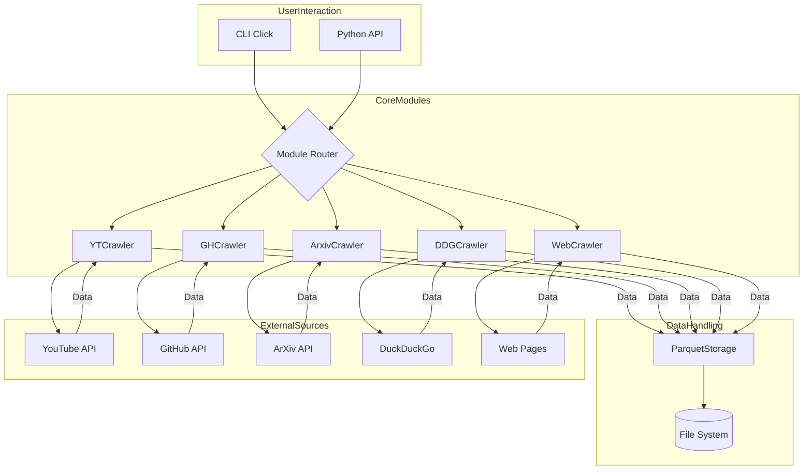

<p align="center">
  
</p>
<p align="center">
  <a href="https://discord.gg/mNeQZzBHuW"></a>
  <a href="https://ko-fi.com/theborch"></a>
</p>

# ⛏️ OARC-Crawlers ⛏️

OARC-Crawlers is a Python framework designed for acquiring, processing, and storing data from diverse online sources including YouTube, GitHub, ArXiv, DuckDuckGo, and general websites. Built with modularity and asynchronous operation, it features specialized crawlers for each source, unified data persistence using Apache Parquet via a central `ParquetStorage` component, and provides both a command-line interface (CLI) and a Python API for interaction. The framework aims to streamline data collection for research, analysis, and integration into agentic AI workflows by delivering structured, analysis-ready outputs.

| Feature                     | Description                                                  |
| :-------------------------- | :----------------------------------------------------------- |
| 🎬 **YouTube Crawler**      | Download videos, playlists, and extract captions             |
| 🐙 **GitHub Crawler**       | Clone repositories and extract code for analysis             |
| 🦆 **DuckDuckGo Crawler**   | Search for text, images, and news                            |
| 🌐 **Web Crawler**          | Extract content from websites using BeautifulSoup            |
| 📜 **ArXiv Crawler**        | Download academic papers and their LaTeX source              |
| 💾 **Parquet Storage**      | Utility for saving and loading data in Parquet format        |

## Setup

OARC-Crawlers requires Python >=3.10 and <3.12 (Python 3.12+ is not yet fully supported due to some dependency compatibility issues).

```bash
# Install package from PyPI
pip install oarc-crawlers
```

## Using the CLI

Once setup, the `OARC-Crawlers` package can be installed directly using pip and used immediately from the command line, without any complex setup. See our [Cheat Sheet](docs/CHEATSHEET.md) for quick reference of common commands.

```bash
# Basic CLI usage examples
oarc-crawlers yt download --url "https://youtube.com/watch?v=dQw4w9WgXcQ"
oarc-crawlers gh analyze --url "https://github.com/pytorch/pytorch"
oarc-crawlers arxiv download --id "2103.00020"
oarc-crawlers ddg text --query "python async programming" --max-results 5
oarc-crawlers web pypi --package "requests"

# Get help for any command
oarc-crawlers --help
oarc-crawlers yt --help
```

For more detailed CLI usage examples and command patterns, see the [CLI Usage](docs/CLI.md) and [Examples](docs/Examples.md#cli-usage).

## API Usage

OARC-Crawlers provides a simple, intuitive Python API that allows you to integrate any of the crawlers directly into your Python applications or workflows. Each crawler is designed with async support for efficient execution.

### Basic Import Pattern

```python
from oarc_crawlers import (
    YTCrawler,
    GHCrawler,
    ArxivCrawler,
    DDGCrawler,
    WebCrawler,
    ParquetStorage,
)
```

### Quick Examples

```python
import asyncio
from oarc_crawlers import YTCrawler, ParquetStorage

async def download_video():
    # Initialize the crawler
    yt = YTCrawler(data_dir="./data")
    
    # Download a video
    result = await yt.download_video("https://youtube.com/watch?v=dQw4w9WgXcQ")
    
    # Print the result
    print(f"Video saved to: {result.get('file_path', 'N/A')}")
    print(f"Video title: {result.get('title', 'Unknown')}")

# Run the async function
asyncio.run(download_video())
```

### Running Example Scripts

The package includes a collection of example scripts that demonstrate how to use each component:

```bash
# Run specific module example
python examples/run_example.py youtube
python examples/run_example.py github
python examples/run_example.py ddg
python examples/run_example.py bs # Note: 'bs' refers to BeautifulSoup/WebCrawler examples
python examples/run_example.py arxiv
python examples/run_example.py parquet

# Run the combined example
python examples/run_example.py combined

# Run all examples
python examples/run_example.py all
```

For detailed examples and advanced usage patterns, check our comprehensive [Examples](docs/Examples.md) documentation.

## Example Categories

| Category | Examples |
|----------|----------|
| **Basic Operations** | [Initializing Crawlers](docs/Examples.md#initializing-crawlers) |
| | [Configuring Storage Paths](docs/Examples.md#configuring-storage-paths) |
| | [Error Handling](docs/Examples.md#error-handling) |
| **YouTube Operations** | [YouTube CLI Examples](docs/Examples.md#youtube-cli-examples) |
| | [Download a Video](docs/Examples.md#download-a-video) |
| | [Download a Playlist](docs/Examples.md#download-a-playlist) |
| | [Extract Captions](docs/Examples.md#extract-captions) |
| | [Search Videos](docs/Examples.md#search-videos) |
| | [Fetch Chat Messages](docs/Examples.md#fetch-chat-messages) |
| **GitHub Operations** | [GitHub CLI Examples](docs/Examples.md#github-cli-examples) |
| | [Clone a Repository](docs/Examples.md#clone-a-repository) |
| | [Analyze Code](docs/Examples.md#analyze-code) |
| | [Search Repositories](docs/Examples.md#search-repositories) |
| **Search Operations** | [DuckDuckGo CLI Examples](docs/Examples.md#duckduckgo-cli-examples) |
| | [Text Search](docs/Examples.md#text-search) |
| | [News and Image Search](docs/Examples.md#news-and-image-search) |
| **ArXiv Operations** | [ArXiv CLI Examples](docs/Examples.md#arxiv-cli-examples) |
| | [Downloading Papers](docs/Examples.md#downloading-papers) |
| | [Extracting LaTeX Sources](docs/Examples.md#extracting-latex-sources) |
| | [Extracting Keywords and References](docs/Examples.md#extracting-keywords-and-references) |
| | [Working with Categories](docs/Examples.md#working-with-categories) |
| | [Generate Citation Network](docs/Examples.md#generate-citation-network-1) |
| **Web Crawling** | [Web Crawler CLI Examples](docs/Examples.md#web-crawler-cli-examples) |
| | [Crawling Websites](docs/Examples.md#crawling-websites) |
| | [Extracting Specific Content](docs/Examples.md#extracting-specific-content) |
| **Data Management** | [Data Management CLI Examples](docs/Examples.md#data-management-cli-examples) |
| | [Working with Parquet Files](docs/Examples.md#working-with-parquet-files) |
| | [Converting Between Formats](docs/Examples.md#converting-between-formats) |
| | [Working with the Parquet Storage System](docs/Examples.md#working-with-the-parquet-storage-system) |

## Development

For development purposes, oarc-crawlers can be installed by cloning the repository:

```bash
# Clone the repository
git clone https://github.com/Ollama-Agent-Roll-Cage/oarc-crawlers.git
cd oarc-crawlers

# Install UV package manager
pip install uv

# Create & activate virtual environment with UV (use 3.10 or 3.11)
uv venv --python 3.11

# Install the package and dependencies in one step
uv run pip install -e .[dev]
```

### Package Structure

```Bash
oarc-crawlers/
├── .github/                     # GitHub workflows and config
├── docs/                        # Core documentation
├── examples/                    # Example usage scripts
├── src/
│   └── oarc_crawlers/           # Source code to package
│   └── tests/                   # Unit tests
└── README.md                    # Project overview
└── LICENSE                      # Apache 2.0
```

See the [Project Structure](docs/Project.md) for a detailed module breakdown.

### Running OARC Tests

To run all tests:

```bash
uv run pytest
```

Or to run a specific test:
```bash
uv run pytest src/tests/test_parquet_storage.py
```

## Architecture

The `oarc-crawlers` package is designed with a modular architecture, allowing for easy extension and maintenance. Each crawler (`YTCrawler`, `GHCrawler`, `ArxivCrawler`, `DDGCrawler`, `WebCrawler`) operates independently but shares a common interface for data storage via the `ParquetStorage` utility. The system leverages asynchronous programming (`asyncio`) for efficient I/O operations, especially crucial for network-bound tasks like downloading videos or cloning repositories. A unified Command Line Interface (CLI) built with `click` provides a consistent user experience across all modules.



## FAQ

**Q: What is OARC-Crawlers?**  
A: OARC-Crawlers is a modular Python framework for acquiring, processing, and storing data from sources like YouTube, GitHub, ArXiv, DuckDuckGo, and general websites. It provides both CLI and Python API interfaces, with unified Parquet storage for all outputs.

**Q: Which Python versions are supported?**  
A: Python 3.10 and 3.11 are supported. Python 3.12+ is not yet fully supported due to dependency compatibility.

**Q: How do I install OARC-Crawlers?**  
A: You can install via pip (`pip install oarc-crawlers`) or from source. See the "Setup" section above for details.

**Q: What is the recommended way to manage environments?**  
A: Use the `uv` package manager to create a virtual environment with Python 3.10 or 3.11 for best compatibility.

**Q: How do I run a crawler from the command line?**  
A: Use the CLI, e.g.,  
```bash
oarc-crawlers yt download --url "https://youtube.com/watch?v=..."
oarc-crawlers gh analyze --url "https://github.com/..."
```
See the CLI Usage section for more examples.

**Q: How do I use the Python API?**  
A: Import the relevant crawler and use async methods. Example:
```python
from oarc_crawlers import YTCrawler
yt = YTCrawler(data_dir="./data")
result = await yt.download_video("https://youtube.com/watch?v=...")
```

**Q: What data format is used for storage?**  
A: All crawlers use Apache Parquet for structured, efficient, and analysis-ready data storage.

**Q: Can I use OARC-Crawlers in agentic or AI workflows?**  
A: Yes. The framework is designed for integration with agentic systems and supports asynchronous operation for non-blocking workflows.

**Q: How does error handling work?**  
A: Errors are logged and returned as structured output (e.g., dictionaries with error messages) rather than raising exceptions, allowing workflows to continue when possible.

**Q: Where can I find more examples?**  
A: See the [Examples](docs/Examples.md) documentation for detailed usage patterns.

**Q: How do I report bugs or request features?**  
A: Please open an issue on [GitHub Issues](https://github.com/Ollama-Agent-Roll-Cage/oarc-crawlers/issues).

**Q: Where can I get help?**  
A: Refer to the [Troubleshooting Guide](docs/Troubleshoot.md) or contact the maintainers via email or GitHub Issues.

## Troubleshooting

For common issues and their solutions, please refer to our [Troubleshooting Guide](docs/Troubleshoot.md).

Quick links:
- [Virtual Environment Issues](docs/Troubleshoot.md#virtual-environment-issues)
- [Installation Problems](docs/Troubleshoot.md#installation-problems)
- [Dependency Conflicts](docs/Troubleshoot.md#dependency-conflicts)
- [Runtime Errors](docs/Troubleshoot.md#runtime-errors)
- [Platform-Specific Issues](docs/Troubleshoot.md#platform-specific-issues)
- [CLI & API Issues](docs/Troubleshoot.md#cli--api-issues)
- [MCP & VS Code Integration](docs/Troubleshoot.md#mcp--vs-code-integration)

## MCP & VS Code Integration

OARC-Crawlers provides a Model Context Protocol (MCP) server for agentic workflows and VS Code Copilot Chat integration.

- See [docs/VSCodeMCP.md](docs/VSCodeMCP.md) for setup and troubleshooting.
- To run the MCP server:
  ```bash
  oarc-crawlers mcp run
  ```
- To install for VS Code:
  ```bash
  oarc-crawlers mcp install --name "OARC Crawlers"
  ```

## License

This project is licensed under the [Apache 2.0 License](LICENSE)

## Citations

Please use the following BibTeX entry to cite this project:

```bibtex
@software{oarc_crawlers,
  author = {OARC Team},
  title = {OARC-Crawlers: OARC's dynamic webcrawler module collection},
  year = {2024},
  publisher = {GitHub},
  journal = {GitHub repository},
  howpublished = {\url{https://github.com/Ollama-Agent-Roll-Cage/oarc-crawlers}}
}
```

## Contact

For questions or support, please contact us at:

- **Email**: <NotSetup@gmail.com>
- **Issues**: [GitHub Issues](https://github.com/Ollama-Agent-Roll-Cage/oarc-crawlers/issues)