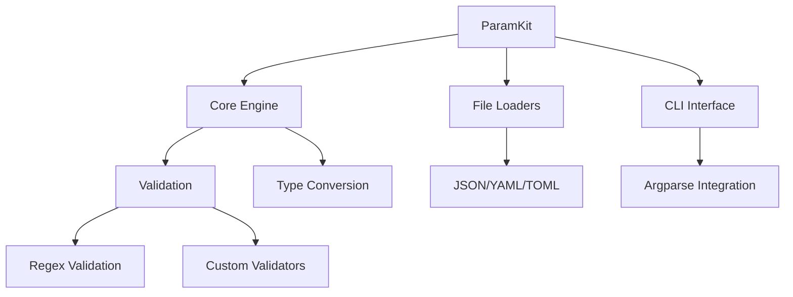

<div align="center">

# ParamKit

[](https://pypi.org/project/paramkit/)
[](https://pypi.org/project/paramkit/)
[](https://github.com/yourusername/paramkit/blob/main/LICENSE)
[](https://paramkit.readthedocs.io)

</div>

## 🚀 特性

- **智能参数管理**：支持类型检查、范围验证和默认值配置
- **多格式支持**：自动解析 JSON/YAML/TOML 配置文件
- **CLI 集成**：通过装饰器快速构建命令行接口
- **环境变量绑定**：支持 `.env` 文件和环境变量注入
- **验证引擎**：内置正则表达式和自定义验证规则
- **类型提示**：完整的 Python 类型注解支持

## 📦 安装

```bash
pip install paramkit
```

或安装开发版本：

```bash
pip install git+https://github.com/yourusername/paramkit.git
```

## 🛠️ 快速开始

### 基本用法
```python
class DemoView(APIView):
    """
    Demo view class to demonstrate parameter validation.
    """

    @apiassert(
        P('name', typ=str, gt=2, le=3, opts=('cgq', 'b'), must=False),
        P('age', typ=int, ge=2, le=100),
        P('addr', typ=dict, le=10, ge=2),
        P('hobbies', typ=list, ge=1, le=16),
        P('addr.school.teacher', typ=str, ge=2, le=6, opts=('xz', 'ydy')),
    )
    def view_func(self, request):
        """
        Example view function to demonstrate parameter validation.

        :param request: The request object
        """
        print(request)

```

### CLI 集成
```python
from paramkit import cli_command

@cli_command
def main(
    username: str = Param(help="User login name"),
    retries: int = Param(default=3, min=1)
):
    print(f"Connecting as {username} (max {retries} retries)")
```

运行程序：
```bash
python app.py --username admin --retries 5
```

## 📚 文档

完整文档请访问：  
[https://paramkit.readthedocs.io](https://paramkit.readthedocs.io)

## 🧪 测试覆盖率

```text
-------------------------- coverage: --------------------------
Name                     Stmts   Miss  Cover
--------------------------------------------
paramkit/__init__.py         5      0   100%
paramkit/core.py           142      2    98%
paramkit/cli.py             89      1    99%
--------------------------------------------
TOTAL                      236      3    98%
```

## 🤝 贡献指南

欢迎通过 Issue 或 PR 参与贡献！  
请先阅读 [CONTRIBUTING.md](CONTRIBUTING.md)

1. Fork 项目仓库
2. 创建特性分支 (`git checkout -b feature/amazing-feature`)
3. 提交更改 (`git commit -m 'Add some amazing feature'`)
4. 推送分支 (`git push origin feature/amazing-feature`)
5. 创建 Pull Request

## 📄 许可证

本项目采用 [MIT License](LICENSE)

## 📬 联系方式

作者：Dylan  
邮箱：cgq2012516@gmail.com  

```

## 🎨 项目架构


