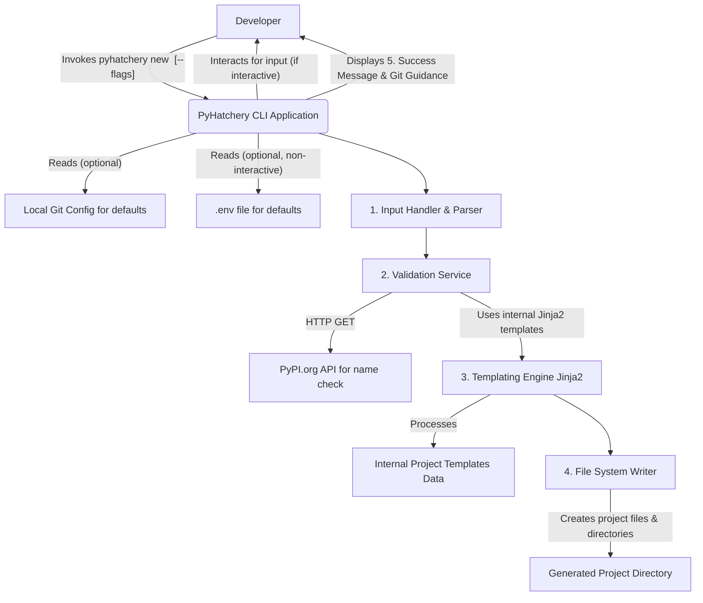
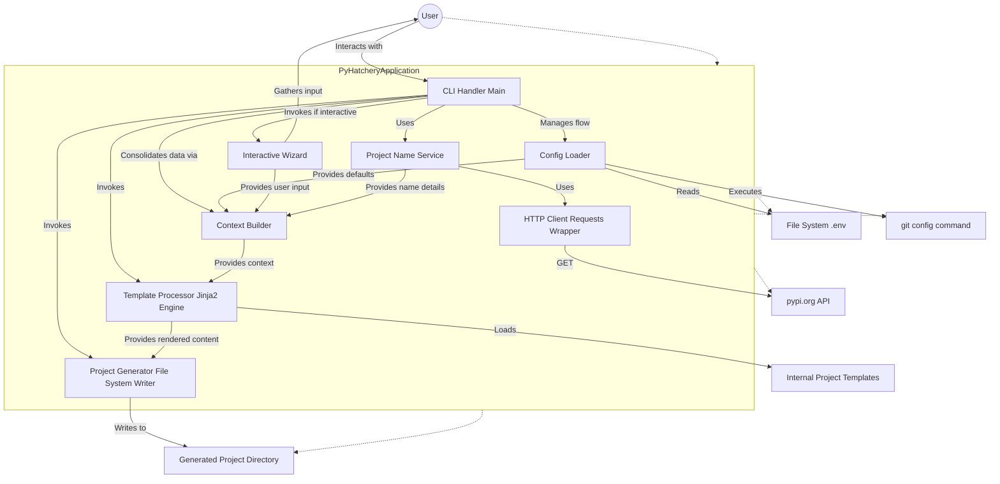
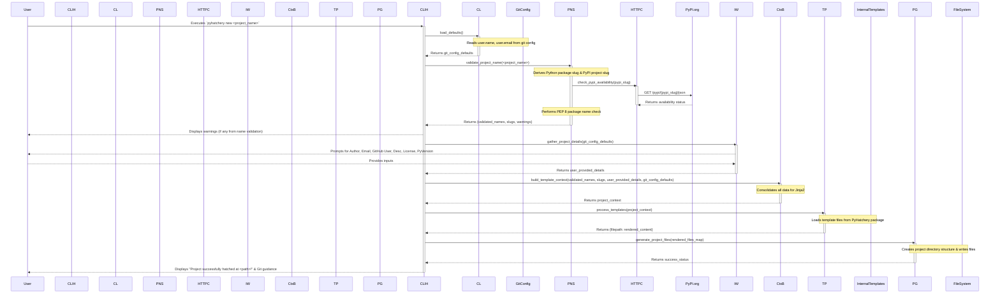

# PyHatchery Architecture Document

## Technical Summary

PyHatchery is a command-line interface (CLI) tool developed in Python (>=3.11) and packaged using `hatchling`. Its primary purpose is to automate the generation of standardized Python project structures, pre-configured with modern development tools like `uv`, `ruff`, `pylint`, and `hatchling`. The architecture revolves around a modular CLI application that processes user inputs—either interactively through a wizard or non-interactively via command-line flags and `.env` files. It utilizes `jinja2` for templating project files based on these inputs and performs validation checks, such as PyPI name availability (using an HTTP client like `requests`) and Python package name PEP 8 conformance. PyHatchery itself is designed for distribution via PyPI, enabling installation with `pip install pyhatchery`. The core architectural goal is to provide a robust, maintainable, and extensible system for scaffolding new Python projects efficiently and according to established best practices.

## High-Level Overview

PyHatchery operates as a single, self-contained CLI application. The primary architectural style is a modular monolith, which is well-suited for a CLI tool of this nature. The main user interaction flow begins when a developer invokes the `pyhatchery new <project_name>` command. This triggers a sequence of operations within the application:

1. **Input Processing:** The CLI parses the initial command (project name) and any provided flags. It then gathers further project details (like author name, email, GitHub username, description, license, and Python version preference) either through an interactive wizard or by reading non-interactive flags and a potential `.env` file. Default values (e.g., author details from `git config`) are used where applicable.
2. **Validation:** The collected project name undergoes validation, including checking the derived PyPI package name for potential conflicts on `pypi.org` and verifying the derived Python package name against PEP 8 naming conventions. These checks result in non-blocking warnings if issues are found.
3. **Templating:** A core templating engine, using `jinja2`, processes a set of embedded project template files. These templates are populated with the validated and user-provided data to generate the content of the new project's files.
4. **File System Operations:** The application creates the specified project directory structure (e.g., `<project_name>/src/<project_name_slug>/`, `tests/`, `docs/`) in the target output location. The personalized files generated by the templating engine are then written into this structure.
5. **User Guidance:** Upon successful generation, PyHatchery provides feedback to the user, including the path to the new project and instructions for initializing a Git repository.

The overall data flow is from user input, through internal processing and templating, to file system output.

## Component View

PyHatchery's internal architecture is designed as a set of collaborating components, each with a distinct responsibility, to manage the project generation workflow.

**Core Component Descriptions:**

1. **`CLI Handler (Main)`:**
    * **Responsibility:** The main entry point of the application. Parses initial command-line arguments (like `new`, `<project_name>`, `--output-dir`, `--no-interactive`, and other non-interactive flags) using a library like `argparse`. Orchestrates the overall workflow by invoking other components in sequence. Handles top-level error catching and user feedback messages (e.g., success, failure, help text).
    * **Interactions:** Receives input from the User. Invokes the `Interactive Wizard` (if applicable), `Config Loader`, `Project Name Service`, `Context Builder`, `Template Processor`, and `Project Generator`.

2. **`Config Loader`:**
    * **Responsibility:** Loads default configuration values. Specifically, attempts to read the user's name and email from `git config`. If in non-interactive mode, it also loads values from a `.env` file in the current directory using `python-dotenv`.
    * **Interactions:** Called by the `CLI Handler`. Interacts with the file system (for `.env`) and system commands (for `git config`). Provides loaded config data to the `Context Builder`.

3. **`Interactive Wizard`:**
    * **Responsibility:** If not in `--no-interactive` mode, this component guides the user through a series of prompts to gather essential project details: Author Name, Author Email, GitHub Username, Project Description, License choice, and Python Version preference. It should pre-fill prompts with defaults obtained from `Config Loader` where available.
    * **Interactions:** Invoked by the `CLI Handler`. Receives default values from `Config Loader` (via `CLI Handler` or `Context Builder`). Provides collected user inputs to the `Context Builder`.

4. **`Project Name Service`:**
    * **Responsibility:** Handles all logic related to the project name. This includes:
        * Deriving the "Python package slug" (e.g., `my_project_name`) from the input project name.
        * Validating this slug against PEP 8 naming conventions.
        * Deriving the "PyPI project slug" (e.g., `my-project-name`).
        * Querying `pypi.org` (using an HTTP client like `requests`) to check if the PyPI slug is potentially taken.
        * Providing warnings based on these checks.
    * **Interactions:** Invoked by the `CLI Handler` (or `Context Builder`). Interacts with an external `HTTP Client` for the PyPI check. Returns validated/slugified names and any warnings.

5. **`Context Builder`:**
    * **Responsibility:** Consolidates all project configuration data into a single "context" dictionary or object. This includes:
        * The project name and its derived slugs (from `Project Name Service`).
        * User details from `Interactive Wizard` or CLI flags/`.env` (via `Config Loader`).
        * Default values (e.g., current year for license).
        * Any other dynamic data needed for templating.
        * This context is what gets passed to the `Template Processor`.
    * **Interactions:** Receives data from `CLI Handler`, `Config Loader`, `Interactive Wizard`, and `Project Name Service`. Provides the final context to the `Template Processor`.

6. **`Template Processor (Jinja2 Engine Wrapper)`:**
    * **Responsibility:** Manages the `jinja2` templating environment. Loads template files from PyHatchery's internal template directory. Renders these templates using the context provided by the `Context Builder`.
    * **Interactions:** Invoked by the `CLI Handler`. Receives the context from `Context Builder`. Reads template files from an internal `templates/` directory. Outputs rendered file content (strings).

7. **`Project Generator (File System Writer)`:**
    * **Responsibility:** Handles all file system operations for creating the new project. This includes:
        * Creating the root project directory and standard subdirectories (`src/<python_package_slug>/`, `tests/`, `docs/`).
        * Writing the rendered file content (from `Template Processor`) to the correct locations within the new project structure.
        * Ensuring the template's `.git` directory (if any internal template source had one) is not copied.
    * **Interactions:** Invoked by the `CLI Handler`. Receives rendered file content and target paths. Interacts directly with the file system.

8. **`HTTP Client (Wrapper for Requests)`:**
    * **Responsibility:** A thin wrapper around the `requests` library (or chosen HTTP client) to handle the PyPI name check. Encapsulates the actual HTTP GET request, error handling (timeouts, network issues), and response parsing for the `Project Name Service`.
    * **Interactions:** Used by the `Project Name Service`. Makes external HTTP calls to `pypi.org`.

## Key Architectural Decisions & Patterns

This section outlines the significant architectural choices and patterns employed in PyHatchery to meet its functional and non-functional requirements, ensuring a robust, maintainable, and user-friendly CLI tool.

1. **Modular Monolith for CLI:**
    * **Decision:** PyHatchery is designed as a modular monolithic application. While it consists of distinct internal components (as detailed in the "Component View"), these components operate within a single process and are packaged together.
    * **Justification:** This approach is well-suited for a self-contained CLI tool. It simplifies development, deployment (single executable/package), and testing compared to distributed architectures, while still allowing for good internal organization and separation of concerns.

2. **Direct Jinja2 Templating:**
    * **Decision:** All project file generation is handled by directly using the `Jinja2` templating engine with a custom set of internal templates.
    * **Justification:** As specified in the PRD, this provides maximum control over the templating process and output, avoiding abstractions from higher-level scaffolding tools like Cookiecutter for PyHatchery's core generation logic. This allows for fine-tuned personalization and addresses specific requirements directly.

3. **Configuration Loading Strategy:**
    * **Decision:** A layered approach is used for gathering project configuration and user details:
        1. Command-Line Interface (CLI) flags take the highest precedence.
        2. Values from a `.env` file (if present in non-interactive mode) are used next.
        3. Defaults from `git config` (e.g., user name, email) are then applied.
        4. Finally, hardcoded application defaults (e.g., "MIT" for license) are used if no other value is provided.
    * **Justification:** This offers users flexibility, allowing them to specify configurations through multiple convenient methods, catering to both interactive use and automated scripting. Libraries like `python-dotenv` will be used for `.env` parsing, and `subprocess` for `git config` calls.

4. **CLI Argument Parsing:**
    * **Decision:** The Python standard library's `argparse` module is used for parsing command-line arguments and subcommands.
    * **Justification:** `argparse` is robust, part of the standard library (no external dependency for this core function), and well-understood by Python developers. It capably handles the required CLI structure (e.g., `pyhatchery new <project_name> --flags`).

5. **Interactive Input Handling:**
    * **Decision:** For interactive mode, standard Python `input()` prompts will be used to gather information from the user. Input validation will be performed for each prompt where necessary.
    * **Justification:** This approach is straightforward to implement for the defined scope, requires no external dependencies for basic interaction, and provides a universally familiar CLI experience.

6. **Project Name Processing and Validation:**
    * **Decision:** A dedicated `Project Name Service` component handles:
        * Slugification: Creating a "Python package slug" (lowercase, underscores) for internal use (e.g., `src/` directory) and a "PyPI project slug" (lowercase, hyphens) for `pyproject.toml` and URLs.
        * Validation: Checking the Python package slug against PEP 8 conventions and the PyPI project slug against `pypi.org` for potential name conflicts (using an HTTP client).
    * **Justification:** This centralizes complex name-related logic, improves code organization, and implements key usability features like PyPI name conflict warnings.

7. **File System Abstraction:**
    * **Decision:** Python's `pathlib` module will be used for all file system path manipulations. Standard library functions from `os` and `shutil` will be used for actual file/directory creation and writing.
    * **Justification:** `pathlib` offers a modern, object-oriented, and cross-platform approach to path handling, reducing errors and improving code readability. `os` and `shutil` are standard and reliable for I/O operations.

8. **Error Handling and User Feedback:**
    * **Decision:**
        * The application will provide clear, user-friendly error messages for common issues (e.g., invalid input, file system errors, failed PyPI check).
        * Graceful handling of the PyPI name check: network errors or API unavailability will result in a warning, allowing the user to proceed.
        * Distinct exit codes may be used to signify different error conditions for scripting purposes.
    * **Justification:** Good error handling is crucial for a positive user experience, especially in a CLI tool. Allowing users to proceed despite a failed optional check (like PyPI availability) enhances usability.

9. **Internal Template Storage:**
    * **Decision:** The project template files that PyHatchery uses to generate new projects will be bundled within the PyHatchery package itself (e.g., in a dedicated `templates` subdirectory).
    * **Justification:** This makes PyHatchery a self-contained tool that doesn't require users to download templates separately, simplifying distribution and usage.

10. **HTTP Client for External Calls:**
    * **Decision:** A simple wrapper around the `requests` library (or a similar robust HTTP client) will be used for making the call to the PyPI API.
    * **Justification:** `requests` is a widely adopted, feature-rich, and user-friendly library for HTTP calls, simplifying the interaction with the PyPI API and handling aspects like connection management and timeouts.

## Core Workflow / Sequence Diagrams

### Interactive Project Generation Flow

This diagram illustrates the sequence of interactions when a user generates a new project using PyHatchery in interactive mode.

## Infrastructure and Deployment Overview

As PyHatchery is a command-line interface (CLI) tool intended for local execution by developers, its "infrastructure" and "deployment" primarily refer to its development lifecycle, testing, packaging, and distribution mechanisms, rather than a hosted service environment.

* **Cloud Provider(s):** Not Applicable. PyHatchery is installed and runs on local user machines.
* **Core Services Used (for runtime):** Not Applicable.
* **Infrastructure as Code (IaC):** Not Applicable for the tool's own deployment.

* **Deployment Strategy (Distribution of PyHatchery):**
  * PyHatchery is distributed as a Python package via the Python Package Index (PyPI).
  * End-users install PyHatchery using `pip install pyhatchery`.
  * New versions are built and published to PyPI. The publishing process is managed via GitHub Actions, typically triggered by pushes to the `main` branch or by version tags (e.g., `vX.Y.Z`).

* **CI/CD Pipeline (GitHub Actions):**
    PyHatchery utilizes GitHub Actions for its Continuous Integration and Continuous Deployment (CI/CD) pipeline. The workflow files are located in the `.github/workflows/` directory (e.g., `tests.yml`, `publish.yml`).
  * **Automated Testing (`tests.yml`):**
    * **Triggers:** On every push to `main` and `develop` branches, and on pull requests targeting these branches.
    * **Process:** Sets up a matrix for multiple Python versions (e.g., 3.10, 3.11, 3.12). For each version, it checks out the code, sets up Python and `uv`, installs dependencies using `uv sync --dev`, and then runs quality checks.
    * **Quality Checks:** Includes linting with `uv run ruff check .`, format checking with `uv run ruff format --check .`, comprehensive linting with `uv run pylint .` (targeting source and test directories), and running tests with coverage using `uv run pytest -v --cov=src/pyhatchery --cov-report=term-missing` (adjust coverage path as needed).
  * **Automated Publishing (`publish.yml`):**
    * **Triggers:** On pushes to the `develop` branch (for TestPyPI) and pushes to the `main` branch or version tags (e.g., `v*.*.*`) for PyPI.
    * **Condition:** Publishing proceeds based on the `ENABLE_PUBLISHING` environment variable defined within the workflow file.
    * **Secrets:** Requires `TEST_PYPI_API_TOKEN` and `PYPI_API_TOKEN` to be configured as secrets in the GitHub repository.
    * **Process:** Checks out code, sets up Python and `uv`, installs dependencies, builds the package (sdist and wheel) using `uv build --sdist --wheel -o dist/ .`, and then publishes to the appropriate index (TestPyPI or PyPI) using `uv publish`.

* **Environments (for PyHatchery Development & Release):**
  * **Local Development:** Developers use local Python virtual environments (managed with `uv`) on their respective operating systems (Linux, macOS, Windows).
  * **CI Environment:** GitHub Actions provides ephemeral, isolated environments for running tests and builds.
  * **Package Staging (TestPyPI):** TestPyPI acts as a staging repository to test the integrity and metadata of the PyHatchery package before releasing it to the official PyPI.
  * **Package Production (PyPI):** The official Python Package Index is the production distribution channel for PyHatchery.

* **Environment Variables for PyHatchery CLI Runtime:** PyHatchery as a CLI tool primarily uses command-line arguments and a potential `.env` file (for default user/project info in non-interactive mode) for its configuration during execution on a user's machine. It does not rely on system environment variables for its own core runtime configuration beyond standard Python or system behaviors. The significant environment variables (`ENABLE_PUBLISHING`, API tokens) are relevant to its CI/CD and deployment process within GitHub Actions.

## Key Reference Documents

This architecture document should be read in conjunction with the following key documents which provide further details on requirements, design, and specifications for PyHatchery:

* **Project Planning & Requirements:**
  * [`project_brief.md`][project_brief] (User-provided): Provides the initial vision, goals, and problem statement for PyHatchery.
  * [`prd.md`][PRD] (User-provided): The Product Requirements Document, detailing functional and non-functional requirements, scope, and success criteria. CLI interaction details are covered within this document and the Epics.
  * [`epic_01.md`][epic1] (User-provided): Details for Epic 1: Core Project Generation & CLI.
  * [`epic_02.md`][epic2] (User-provided): Details for Epic 2: File Templating & Personalization.
  * [`epic_03.md`][epic3] (User-provided): Details for Epic 3: Development Tooling Integration.
  * [`epic_04.md`][epic4] (User-provided): Details for Epic 4: CI/CD Workflow Automation.

* **Architectural & Technical Specifications (generated during this process):**
  * [`tech-stack.md`][tech-stack]: Specifies the technology stack used for PyHatchery itself.
  * [`project-structure.md`][proj-structure]: Outlines the directory and file structure of the PyHatchery project.
  * [`coding-standards.md`][code-standards]: Defines coding conventions, patterns, and best practices for PyHatchery development.
  * [`testing-strategy.md`][testing]: Describes the approach to testing PyHatchery.
  * [`data-models.md`][dataModelsLink]: Details key data structures, primarily the `project_context` object used for templating.
  * [`api-reference.md`][apiReferenceLink]: Documents external APIs consumed by PyHatchery (i.e., the PyPI API).
  * [`environment-vars.md`][envVarReference]: Lists environment variables relevant to PyHatchery's CI/CD and publishing process.

## Change Log

| Change                                                                 | Date       | Version | Description                                                                                                   | Author      |
| :--------------------------------------------------------------------- | :--------- | :------ | :------------------------------------------------------------------------------------------------------------ | :---------- |
| Initial draft: Technical Summary & High-Level Overview                   | 2025-05-09 | 0.1     | Created first sections with initial diagram.                                                                    | 3-Architect |
| Revision: High-Level Overview Mermaid diagram (attempts 1 & 2)           | 2025-05-09 | 0.1.2   | Iteratively corrected diagram syntax based on rendering issues.                                                 | 3-Architect |
| Adopted user-corrected High-Level Overview Mermaid diagram             | 2025-05-09 | 0.2     | Integrated user-provided working diagram.                                                                       | 3-Architect |
| Drafted: Component View                                                | 2025-05-09 | 0.3     | Defined core components, their responsibilities, and an initial interaction diagram.                            | 3-Architect |
| Adopted user-corrected Component View Mermaid diagram                  | 2025-05-09 | 0.4     | Integrated user-provided working diagram for components.                                                        | 3-Architect |
| Drafted: Key Architectural Decisions & Patterns                          | 2025-05-09 | 0.5     | Outlined significant architectural choices and design patterns.                                                 | 3-Architect |
| Drafted: Core Workflow / Sequence Diagram (Interactive Flow)             | 2025-05-09 | 0.6     | Illustrated the interactive project generation sequence.                                                        | 3-Architect |
| Drafted: Infrastructure and Deployment Overview                          | 2025-05-09 | 0.7     | Detailed CI/CD pipeline and distribution strategy for PyHatchery.                                               | 3-Architect |
| Finalized: Key Reference Documents & Change Log                          | 2025-05-09 | 1.0     | Added "Key Reference Documents" (updated per user feedback) and this "Change Log". Architecture draft complete. | 3-Architect |

[project_brief]: ./project_brief.md
[PRD]: ./prd.md
[epic1]: ./epic_01.md
[epic2]: ./epic_02.md
[epic3]: ./epic_03.md
[epic4]: ./epic_04.md
[tech-stack]: ./tech_stack.md
[proj-structure]: ./project-structure.md
[code-standards]: ./coding-standards.md
[testing]: ./testing-strategy.md
[dataModelsLink]: ./data-models.md
[apiReferenceLink]: ./api-reference.md
[envVarReference]: ./environment-vars.md
