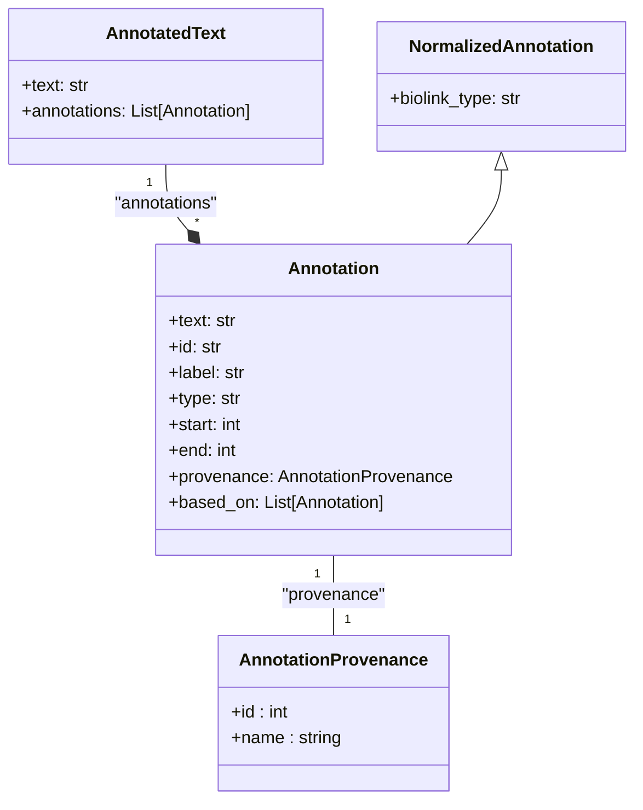

# renci-ner
A library for accessing RENCI NER services

## Usage

This package uses [uv](https://github.com/astral-sh/uv) and [poetry](https://python-poetry.org/) for Python packaging,
and [pytest](https://docs.pytest.org/en/stable/) for testing.

You can run the tests by running:

```shell
$ uv run pytest                                                                                                                                                   ─╯
========================================================================= test session starts =========================================================================
platform darwin -- Python 3.11.11, pytest-8.3.5, pluggy-1.5.0
rootdir: /Users/gaurav/Developer/ner/renci-ner
configfile: pyproject.toml
collected 6 items                                                                                                                                                     

tests/biomegatron/test_biomegatron.py .                                                                                                                         [ 16%]
tests/core/test_core.py .                                                                                                                                       [ 33%]
tests/multiple_annotators/test_multiple_annotators.py .                                                                                                         [ 50%]
tests/nameres/test_nameres.py .                                                                                                                                 [ 66%]
tests/nodenorm/test_nodenorm.py .                                                                                                                               [ 83%]
tests/sapbert/test_sapbert.py .                                                                                                                                 [100%]

========================================================================= 6 passed in 10.05s ==========================================================================
```

To contribute, note that GitHub Actions will run all the tests using PyTest and will use
[ruff](https://github.com/astral-sh/ruff) to check linting. To reformat your code, run:

```shell
$ uv run ruff format
17 files left unchanged
```

## Data model



This library is based around the following core classes
found in [`renci_ner.core`](src/renci_ner/core.py).

### AnnotatedText

A piece of text along with its annotations.

* `text` (str): The text.
* `annotations` (list of `Annotation`): Its annotations.

Additionally, `AnnotatedText` has methods to help chain
`Annotators` and `Transformers` together.

* `reannotate()`: Reannotate the annotations in this AnnotatedText using a
  particular Annotator. By default, each annotator text is run through the
  annotator and -- if changed -- the new annotation is used.
* `transform()`: Transform the annotations in this AnnotatedText using a
  particular Transformer. Transformers can modify the entire AnnotatedText
  in any way they see fit, as long as they keep the previous annotations
  in the new annotation's `based_on` list and update the `provenances` list
  appropriately.

### Annotation

An annotation that includes the text being annotated,
an identifier for the annotation, a type for the annotation,
and a list of entities that are annotated.

Annotations have a history that is stored in the following way:
1. Whenever a `reannotate()` or `transform()` method is called,
   a new annotation MAY be created to replace the existing annotation.
   The `based_on` list stores every previous annotation in case that
   history is ever useful, to look at e.g. where it was normalized or
   what tools it passed through.
2. Provenance information does not include the properties being used
   (e.g. whether GeneProtein conflation is turned on for NodeNorm).
   These are currently handled in the `reannotate()` and `transform()`
   to make provenance comparisons more straightforward.
3. Annotations NEED NOT BE REPLACED. Say you annotate entities using an Annotator,
   and then Tranform them using NodeNorm: only the annotations changed by NodeNorm
   will be replaced, while other annotations will remain the same.

An annotation does not have a `curie` or a `biolink_type` -- it only gains these
properties after it has been changed into a `NormalizedAnnotation`.

* `text` (str): The text being annotated. This SHOULD NOT be changed!
* `id` (str): An identifier for the annotation.
* `label` (str): The label for the annotation.
* `type` (str): The type of the annotation.
* `start` (int): The start index of the annotation.
* `end` (int): The end index of the annotation.
* `provenance` (`AnnotationProvenance`): The provenance for this annotation.
  The `provenances` property provides a list of all the provenances
  that have been used to create this annotation by reading them from the `based_on` list.
* `based_on` (list of `Annotation`): The chain of annotations that got us to this
  point, with `based_on[0]` being the first annotation and `based_on[-1]`
  being the most recent annotation before this one.

### NormalizedAnnotation (Annotation)

An annotation that additionally has CURIE and Biolink Type properties.
Normalizing an annotation will create a new NormalizedAnnotation.
You can use typing or duck typing to determine if an annotation is a
NormalizedAnnotation (i.e. via `instanceof()` or `ann.biolink_type`).
The ID should be a CURIE.

* `biolink_type` (str): The Biolink type for the entity.

### AnnotationProvenance

A lightweight description of an annotation's provenance. This is intended to be easy
to compare.

This doesn't currently include the properties used in the lookups, but that might
be necessary someday.

* `name` (str): The name of the provenance.
* `url` (str): The URL of the provenance.
* `version` (str): The version of the provenance, usually taken off the OpenAPI version.

## Services

### Annotator

An annotator is a class that can take a piece of text and return an AnnotatedText.

AnnotatedText allows annotators to be chained: for example, you can use BioMegatron
to identify biomedical concepts in a text, then use NameRes or BabelSAPBERT to link those
identifiers to biomedical identifiers.

e.g. BioMegatron -> NameRes, BioMegatron -> BabelSAPBERT

### Transformer

A transformer transforms an AnnotatedText into another AnnotatedText.
AnnotatedText allows transformers to be chained, but doesn't really provide any special features
for that.

e.g. NodeNorm for normalizing IDs.
