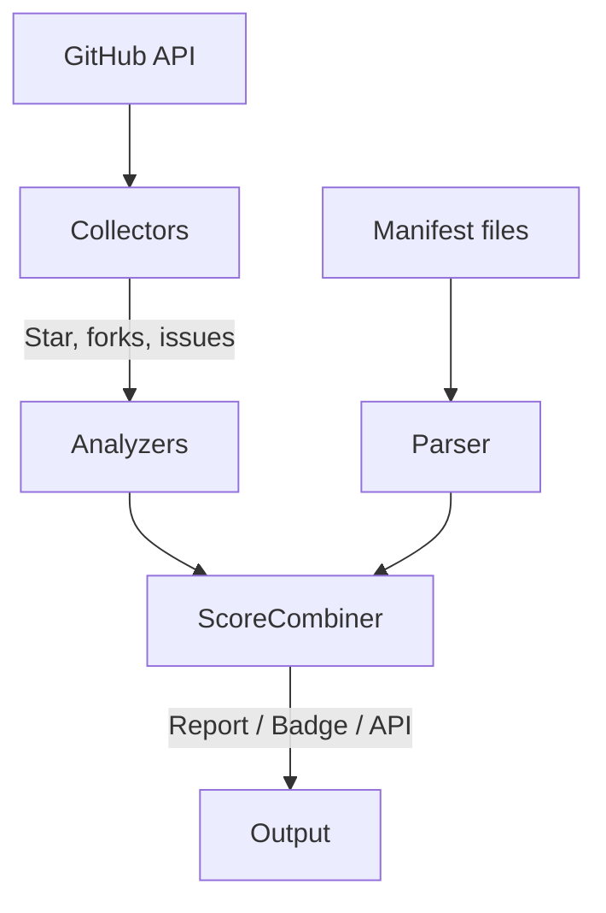

# ⭐ StarGuard: Trust Scores for GitHub Repositories

**CLI tool** to detect fake-star campaigns, dependency hijacks, licence red flags, and other signals of open-source risk.  
Inspired by the [4.5 million fake stars study](https://arxiv.org/abs/2412.13459), StarGuard helps **CTOs, security teams, and VCs** automate open-source due diligence in seconds.

---

## 📌 Why StarGuard?

- **Fake stars are rampant.** Research shows botnets and paid campaigns artificially inflate repo popularity.
- **Supply chain attacks are rising.** Malicious packages and licence traps easily reach production.
- **Manual review doesn’t scale.** StarGuard distills key public signals into a trust score — fast, repeatable, and extensible.

---

## 🚀 Features

| Category      | What StarGuard Checks |
|---------------|------------------------|
| ⭐ **Stars**         | Burst detection (MAD + heuristics), bot-likeness profiling, Fake Star Index, trust badge generation. |
| 📦 **Dependencies**  | SBOM / manifest parsing across npm, PyPI, Maven, Go, Ruby; flags unpinned, shadow, or non-registry deps. |
| ⚖ **Licences**      | Detects unknown or high-risk licences (GPL/AGPL flags), scans both repo and direct deps. |
| 🛠 **Maintainers**   | Contributor concentration, commit cadence, inactivity warnings. |
| 🧪 **Code Signals**  | Pattern scans for obfuscation, remote exec, crypto-mining, or data exfiltration hints. |
| 📤 **Outputs**       | JSON, Markdown, plaintext reports; PNG star-history plots; shields.io badge embed. |

---

## ⚙️ How It Works

1. **GitHub API/GraphQL** – collects stars, forks, issues, traffic stats.
2. **BurstDetector** – sliding window MAD algorithm + rules to catch inorganic star spikes.
3. **User Profiler** – samples stargazers, checks account age, avatar, follower count, repo history.
4. **Dependency & Licence Parsers** – uses API or file-based fallback.
5. **Scoring Engine** – normalises components, applies weighted trust scoring + Fake-Star penalty.



---

## 🧪 Quick Start

### Requirements

- Python ≥ 3.9  
- GitHub Personal Access Token (for high-rate limits)

### Run

```bash
export GITHUB_TOKEN=ghp_xxxxxxxxx

# Full scan with star plot
python starguard.py pytorch/pytorch --format markdown --plot stars.png

# Burst-only fast scan
python starguard.py https://github.com/vercel/next.js --burst-only
```

---

## 🖥 CLI Reference

```bash
python starguard.py OWNER/REPO [options]

Options:
  -t, --token TEXT                GitHub token (or set GITHUB_TOKEN env)
  -f, --format [text|json|markdown]  Output format (default: text)
  -o, --output FILE              Write report to file
  --plot FILE                    Save star-history PNG
  --no-fake-stars                Skip Fake-Star analysis
  --burst-only                   Only run burst detection
  -v, --verbose                  Enable debug logging
```

---

## 🔍 Use-Cases

- **CTOs** – Gate open-source additions during review.
- **Security Teams** – Schedule scans, integrate with security reviews.
- **VCs** – Rapid diligence on "10k stars" developer tools.
- **Open-Source Maintainers** – Show a StarGuard badge for transparency.

---

## 🤝 Contributing

1. Fork and branch
2. Run `make test`
3. Open a PR with small, focused commits

- Follows [Conventional Commits](https://www.conventionalcommits.org/)
- Licensed under Apache-2.0

---

## 🔒 Security & Privacy

- Only public metadata read (unless token provided)
- No code is executed; only static analysis
- Stores no personal data or credentials

---

## 📄 Licence

Apache License 2.0 © 2025 StarGuard contributors
